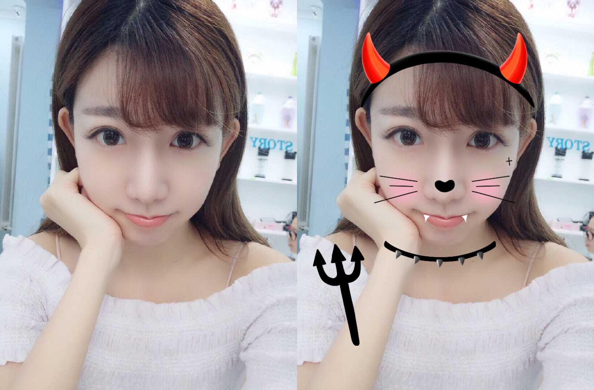
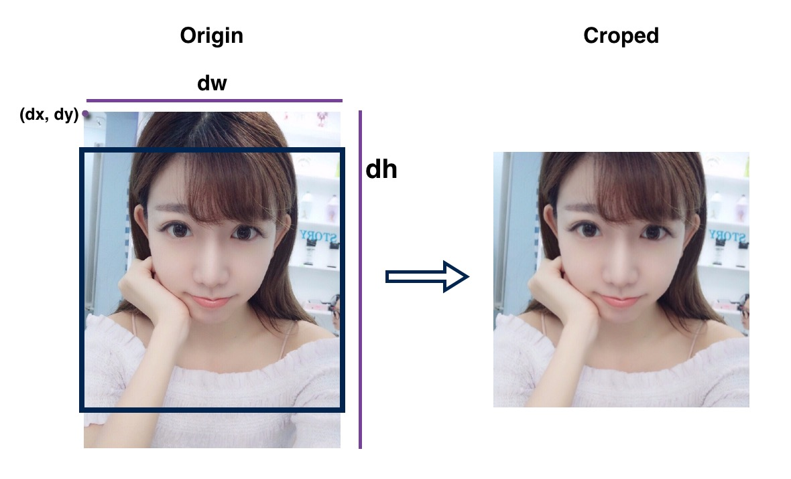
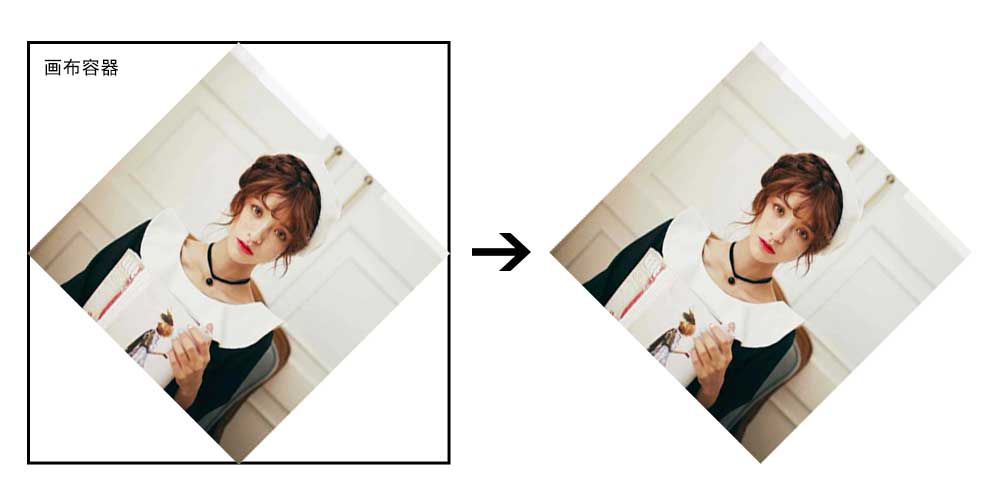

# JavaScript中的图片处理与合成(一)

## 引言：

图片处理现在已经成为了我们生活中的刚需，想必大家也经常有这方面的需求。实际前端业务中，也经常会有很多的项目需要用到图片加工和处理。由于过去一段时间公司的业务需求，让我在这方面积累了一些干货，趁着年后这段时间总结成一系列文章与大家分享，希望能对各位努力中的前端童鞋带来启发和帮助~~~😃

本系列分成以下4个部分:

- 基础类型图片处理技术之缩放与裁剪；
- 基础类型图片处理技术之图片合成；
- 基础类型图片处理技术之文字合成；
- 算法类型图片处理技术；

文章中，我会提到很多在实际实践中所遇到的坑或者经验，应该算是干货满满~~如果能通读，应该能大大提升对前端图片处理领域的理解，有感兴趣的童鞋可以与我深入讨论，希望本文能达到抛砖引玉的效果，让前端在图像处理方面有更多的可能性，有不足之处望请谅解。

通过这些积累，我封装了几个项目中常用的功能：

### **图片合成:** [Example](http://f2er.meitu.com/gxd/mcanvas/example/index.html) [Git](https://github.com/xd-tayde/mcanvas)

### **图片裁剪:** [Example](http://f2er.meitu.com/hmz/ClipImageDemo/example/index.html) [Git](https://github.com/ishareme/clipimage)

### **人像抠除:** [Example](http://f2er.meitu.com/gxd/matting/example/index.html) [Git](https://github.com/xd-tayde/matting)

唠叨完这些老套路后，我们开始起飞！~~✈️✈️✈️

首先，我这里将前端图片处理暂且分成两种类型：**基础类型** 与 **算法类型**；

- **基础类型的图片处理技术:** 图片缩放，旋转，添加边框，图片合成，拼图等业务都属于基础类型的图片处理，其区分点在于**无需使用像素级别的算法**，而是通过计算改变图片的**尺寸及位置**等来改造图片。例如常用的贴纸功能:

<br/>

<div align='center'>
	<br/>
</div>

<br/>

- **算法类型的图片处理:** 这类型的图片处理复杂度较高，特点是通过像素级别算法对图片的**像素点**进行`RGBA`通道值等进行改造，例如我们使用`photshop`或者美图秀秀等工具对图片进行的 美颜 / 滤镜 / 黑白 / 抠图 / 模糊等操作，这类型的重点主要在于**算法和性能**层面。例如常用的妆容功能:

<br/>

<div align='center'>
	<br/>
</div>

<br/>

本系列首先从基础类型处理开启我们的旅程。基础类型的图片处理在实际项目中有着大量的使用场景，主要是运用`canvas`的能力来完成，不存在性能和兼容性问题，能够达到线上运行标准。我这里将基础类型的图片处理大致的分成以下几种类型，这些类型基本能覆盖日常所有业务场景：

- 图片的缩放；
- 图片的裁剪；
- 图片的合成；
	- 图片与图片的合成，例如贴纸，边框，水印等；
	- 为图片添加文字；
	- 为图片添加基础几何图形；

> Tips: 我已将该类型的图片处理场景封装成了一个**插件**，基本上能应付所有这类型图片处理的需求，**[GIT地址](https://github.com/xd-tayde/mcanvas)** (欢迎探讨);

在介绍具体的功能前，由于图片的绘制完全的依赖于图片的加载，因此先来了解一些前置知识。

## 1、图片的跨域

首先，图片加载并绘制涉及了图片的跨域问题，因此如果是一张在线的图片，需要在图片服务器上设置跨域头，并且在前端加载图片之前**将``标签的`crossOrigin`设置为`*`**，否则绘制到画布的时候会报跨域的错误。

> Tips: 这里积累了一些小坑，可以跟大家分享下：
> 
> 1、`crossOrigin`需要严格设置，既**只有是线上图片时，才设置**，而本地路径或者`base64`时，则一定不能设置，否则在某些系统下会报错，导致图片加载失败；
> 
> 2、当项目为本地包环境时，例如内置于 `App`中时，`crossOrigin`值无效，**`webview`的安全机制会导致无论该值设置与否，都会报跨域的错误。**解决办法是：需要将所有图片**转换成`base64`**才能正确绘制；
> 
> 3、`crossOrigin`值一定要在图片加载之前设置，即**为``赋值`src`之前进行设置**，否则无效；

## 2、图片的加载

由于`canvas`的绘制需要的是已经加载完成的图片，我们需要确保绘制的素材图片是已经加载完成的，因此我们需要使用``的`onload`事件，可以**使用`html`中已存在的图片，或者用`js`创建一个图片对象:**

```js
function loadImage(image, loader, error){
	// 创建 image 对象加载图片；
	let img = new Image();
	
	// 当为线上图片时，需要设置 crossOrigin 属性；
	if(image.indexOf('http') == 0)img.crossOrigin = '*';
	img.onload = () => {
	    loaded(img);
	    
	    // 使用完后清空该对象，释放内存；
	    setTimeout(()=>{
	        img = null;
	    },1000);
	};
	img.onerror = () => {
	    error('img load error');
	};
	img.src = image;
}
```
介绍图片加载的前置知识后，我们先来看最简单的图片处理---缩放与裁剪！

> Tips: 相信大家阅读本文时，如果对`canvas`不太了解，可以查询下对应的`API`文档即可，本文不再对`canvas`基础`API`做详细讲解。

## 一、图片的缩放

图片的缩放最常见的场景是做图片的**压缩**。在保证图片清晰的前提下通过合理地缩小图片尺寸，能大大的降低图片的大小。在实际应用场景中，有着广泛的用途。例如图片上传时，用户自主上传的图片可能是一张非常大的尺寸，例如现在手机所拍摄的照片尺寸经常能达到`1920*2560`的尺寸,大小可能超过5M。而在项目中，我们可能并不需要用到这么大的尺寸，此时对图片的压缩能大大的优化加载速度和节省带宽；

### 1、新建一个`canvas`画布，将宽高设置为需要压缩到的尺寸;

该画布既为图片缩放后的尺寸，此处有个点是需要保证图片的比例不变, 因此需要通过计算得出画布的宽与高：

```js
let imgRatio = img.naturalWidth / img.naturalHeight;

// 创建一个画布容器；
let cvs = document.createElement('canvas');

// 获取容器中的画板；
let ctx = cvs.getContext('2d');
cvs.width = 1000;
cvs.height = cvs.width / imgRatio;
```

### 2、将图片画入后再导出成`base64`;

这里使用2个最常用的方法:

- `ctx.drawImage(image, dx, dy, dw, dh)`: 这个方法其实最多可以接收9个参数, 实现压缩，只需要使用其中的5个参数即可, 其余参数在其它部分使用到时再做详解；

	- image : 需要绘制的图片源，需要接收已经 **加载完成** 的`HTMLImageElement`，`HTMLCanvasElement`或者`HTMLVideoElement`；
	- dx / dy : 相对于画布左上角的绘制起始点坐标；
	- dw / dh : 绘制的宽度和高度，宽高比例并不锁定，可使图片变形；

- `cvs.toDataURL(type, quality)`: 该方法用于将画布上的内容导出成 `base64` 格式的图片，可配置2个参数； 

	- type: 图片格式, 一般可以使用 `image/png` 或者 `image/jpeg`, 当图片不包含透明时，建议使用`jpeg`，可使导出的图片大小减小很多；
	
	> Tips: 此处有个坑, 想导出`jpg`格式的图片必须用`image/jpeg`，不能使用`image/jpg`；
	
	- quality: 图片质量，可使用`0~1`之间的任意值；经过测试，该值设置成`0.9`时较为合适，可以有效减小图片文件大小且基本不影响图片清晰度，导出后的 `base64` 既为压缩后的图片；

```js
// 将原图等比例绘制到缩放后的画布上；
ctx.drawImage(image, 0, 0, cvs.width, cvs.height);

// 将绘制后的图导出成 base64 的格式；
let b64 = cvs.toDataURL('image/jpeg', 0.9);
```
### 3.多种格式的图片转换成`base64`;

我们常用的图片上传功能，我们使用的是原生的`<input type="file">`标签，此时获取到的是`File`格式的图片，图片的格式各异且尺寸很大，我们应该压缩处理后再使用。

- 使用`FileReader`:

```js
let file = e.files[0];   
if(window.FileReader) {       
	let fr = new FileReader();      
	fr.onloadend = e => {
		let b64 = e.target.result;
		
		// b64即为base64格式的用户上传图;
	};       
	fr.readAsDataURL(file);
}
```

- 对`base64`的图片使用刚才的`canvas`方式进行压缩的处理；

Tips: 这里有个小坑是，图片的`EXIF`信息中的方向值会影响图片的展示，在`IOS`会出现图片的宽高与图片的方向不匹配的问题，因此需要进行特殊处理，矫正图片的方向。方案:

1、可以使用 `exif.js` 来获取图片信息中的`Orientation`属性，利用`canvas`的旋转绘制来矫正；
 
2、这里有个 `canvasResize.js` 插件，可以解决从 `File` 到 `base64` 的所有问题。

## 二、图片的裁剪

在实际项目中，由于图片的宽高比例各式各样，而展示和使用一般需要一个较为固定的比例，此时便需要将图片裁剪成我们需要的宽高比例，使用到的方式其实和图片的缩放基本一致，主要是通过调整 `drawImage` 的`dx, dy`参数来实现。原理其实是，将`drawImage`的绘制起始点`(dx, dy)`向上偏移，此时由于`canvas`已被我们设置成期望裁剪后的尺寸，而超出画布的部分不会绘制，从而达到裁剪的目的；通过灵活的设置值，基本可以完成各种图片裁剪需求，简单示例图(黑色框代表创建的画布的尺寸): 

<br/>

<div align='center'>
	<br/>
</div>

<br/>

此处以需要将一张`600*800`的长方形图竖直居中裁剪为`600*600`的正方形图为例, 简单封装成一个功能函数:

```js
// 使用方式：
let b64 = cropImage(img, {
    width : 600,
    height : 600,
});

// 居中裁剪
function cropImage(img, ops){
	// 图片原始尺寸；
	let imgOriginWidth = img.naturalWidth,
        imgOriginHeight = img.naturalHeight;
        
    // 图片长宽比，保证图片不变形；
    let imgRatio = imgOriginWidth / imgOriginHeight;
    
    // 图片裁剪后的宽高， 默认值为原图宽高；
	let imgCropedWidth = ops.width || imgOriginWidth,
        imgCropedHeight = ops.height || imgOriginHeight;
        
    // 计算得出起始坐标点的偏移量, 由于是居中裁剪，因此等于 前后差值 / 2；
	let dx = (imgCropedWidth - imgOriginWidth) / 2,
		dy = (imgCropedHeight - imgOriginHeight) / 2;

    // 创建画布，并将画布设置为裁剪后的宽高；
	let cvs = document.createElement('canvas');
	let ctx = cvs.getContext('2d');
	cvs.width = imgCropedWidth;
	cvs.height = imgCropedHeight;
	
    // 绘制并导出图片；
	ctx.drawImage(img, dx, dy, imgCropedWidth, imgCropedWidth / imgRatio);
	return cvs.toDataURL('image/jpeg', 0.9);
}
```

## 三、图片的旋转

图片的旋转的原理同样也是将图片绘制到画布上进行旋转后再导出。其实使用到的是`canvas`的`rotate`方法；

```js
let cvs = document.createElement('canvas');
let ctx = cvs.getContext('2d');

// 将参照点移动到画板的中心点；
ctx.translate(ctx.width/2, ctx.height/2);
// 旋转画板；
ctx.rotate = 90;
// 绘制图片；
ctx.drawImage(img);
// 导出得到旋转后的图片；
cvs.toDataURL();
```

这里有个比较特别的部分，就是这里旋转的是画布的画板部分，并不是整个画布容器，而画布容器外面不会被绘制，因此这里就会出现一个图像四个角被裁剪掉的问题:

<div align='center'>
	<br/>
</div>

解决的方式就是:

将画布容器放大，变成:

<div align='center'>
	<br/>
</div>

上面这个例子中，由于图片是正方形，因此将容器的宽高放大1.5倍便可保证图片不会被裁剪，而现实中的图片由于宽高比例不定，因此这个放大系数是一个动态的值:

> Tips: 由于我们将画板基点移动到画布中心了，因此在绘制的时候，要相对于基点调整 `dx` 与 `dy`;
 
```js
// 创建画布，获取画板；
...

// 放大系数为
let iw = img.width, ih = img.height;
let ir = iw > ih ? iw / ih : ih / iw;

cvs.width = iw * ir * 1.5;
cvs.height = ih * ir * 1.5;
// 将参照点移动到画板的中心点；
ctx.translate(cvs.width/2, cvs.height/2);
// 旋转画板；
ctx.rotate = 90;

// 绘制图片；
ctx.drawImage(img, -cvs.width/2, -cvs.height/2);

// 导出图片；
...

```

## 总结

本文主要介绍了一些前端图片处理的前置知识:

- 图片处理技术分类；
	- 基础类型图片处理技术；
	- 算法类型图片处理技术；
- 图片的跨域；
- 图片的加载；

还有讲解了属于基础类型图片处理中最简单的两类:

- 图片的缩放；
- 图片的裁剪；
- 图片的旋转；

相信大家已经对图片的处理有了个大致的了解了。下篇文章，我们将继续深入研究基础类型中的图片合成，也是各种干货满满，美不胜收~~😂😂😂。

最后，非常感谢各位童鞋的阅读，有何建议或者疑惑，可以随时与我讨论哈~~


