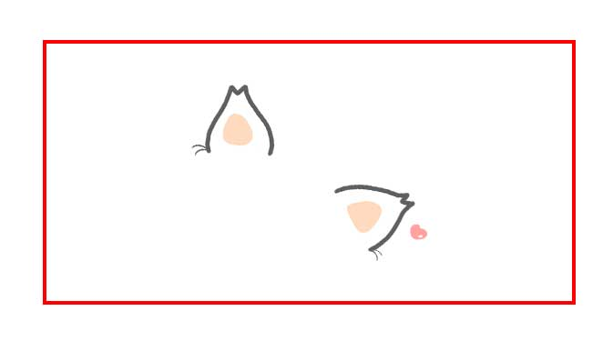
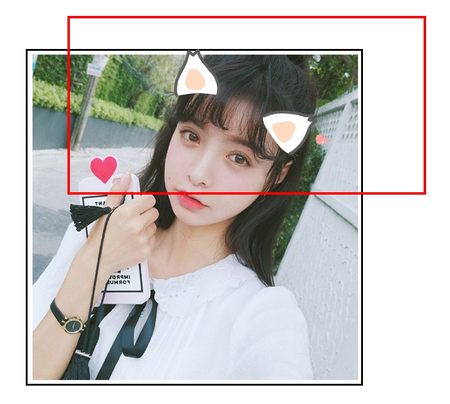

# JavaScript中的图片处理与合成(二)

## 引言

本系列分成以下4个部分:

- 基础类型图片处理技术之缩放、裁剪与旋转([传送门](https://github.com/xd-tayde/blog/blob/master/canvas-1.md))；
- 基础类型图片处理技术之图片合成；
- 基础类型图片处理技术之文字合成；
- 算法类型图片处理技术；

上篇文章，我们介绍了图片的裁剪/旋转与缩放，接下来本文主要介绍图片的合成，这是基础类图片处理中比较实用且复杂的一部分。

通过这些积累，我封装了几个项目中常用的功能：

### **图片合成:** [Example](http://f2er.meitu.com/gxd/mcanvas/example/index.html) [Git](https://github.com/xd-tayde/mcanvas)

### **图片裁剪:** [Example](http://f2er.meitu.com/hmz/ClipImageDemo/example/index.html) [Git](https://github.com/ishareme/clipimage)

### **人像抠除:** [Example](http://f2er.meitu.com/gxd/matting/example/index.html) [Git](https://github.com/xd-tayde/matting)

## 图片的合成

图片的合成在实际项目中运用也是十分的广泛，大家可以试试这个`demo`(仅支持移动端):

### [小狗贴纸](http://api.test.meitu.com/front_end/xiuxiu/online_mapp/tietie_2/index.html?tietieType=1011&pic=http://mtapplet.meitudata.com/57ea433108c45eb2b166.jpg)

<a href="http://api.test.meitu.com/front_end/xiuxiu/online_mapp/tietie_2/index.html?tietieType=1011&pic=http://mtapplet.meitudata.com/57ea433108c45eb2b166.jpg" target="_blank">小狗贴纸</a>

图片的合成原理其实类似于`photoshop`的理念，通过图层的叠加，最后合成并导出，相比于裁剪和缩放，其实基本原理是一致的，但是它涉及了更多的计算和比较复杂的流程，我们先一起来梳理下合成的整个逻辑。

相信大家对 `photoshop`都是较为了解的，我们可以借鉴它的思维方式:

- 新建 `psd` 文件, 设置宽高；
- 设置背景图；
- 从底部到顶部一层层添加所需要的图层；
- 最后直接将整个文件导出成一张图片；

以需要合成下图为例：

<div align='center'>
	<br/>
</div>

1、首先我们需要创建一个与原图一样大小的画布；

2、加载背景图并添加背景图层，也就是这个美女啦~

3、加载猫耳朵图并添加美女头上的猫耳朵图层；

> Tips: 2/3顺序不可逆，否则耳朵会被美女盖在下面哦~因此图片的加载控制十分重要；

4、将整个画布导出成一张图片；

合成部分，主要以封装的插件为栗子哈。这样能尽可能的完整，避免遗漏点。在开始之前，为了确保图片异步绘制的顺序，我们需要先来构建一套队列系统。

### 队列系统；

图片的加载时间是异步且未知的，而图片的合成需要严格保证绘制的顺序，越后绘制的图片会置于越顶层，因此我们需要一套严格机制来控制图片的加载与绘制，否则我们将无法避免的写出回调地狱，这里我使用到了简单的队列系统；

队列系统的原理其实也很简单，主要是为了我们能确保图层从底到顶一层一层的绘制。我设计的使用方式如下：

```js
// 创建画布；
let mc = new MCanvas();

// 添加图层；
mc.add(image-1).add(image-2);

// 绘制并导出图片；
mc.draw();
```

这样我们就明白了，这个队列系统需要下面几个点:

- `queue`队列: 用于存放图层绘制函数；

- `next`函数: 用于表示图层已绘制完毕，执行下一图层的绘制；

- `add`函数: 作为统一添加图层的方法，将绘制逻辑存入函数栈`quene`，并包裹`next`函数；

- `draw`函数: 作为绘制启动函数，表示所有图层已经准备完毕，可以按顺序开始绘制；

```js
MCanvas.queue = [];

MCanvas.prototype.add = function(){
	this.queue.push(()=>{
		// 绘制逻辑，之后详解；
		...
		
		// 执行下个图层绘制；
		this.next();
	});
}

MCanvas.prototype.next = function(){
    if(this.queue.length > 0){
    		// 当队列中还有绘制任务时，则推出并执行；
        this.queue.shift()();
    }else{
    		// 当绘制完成后，调用成功事件，并传出结果图；
        this.fn.success();
    }
};

MCanvas.prototype.draw = function(){
	// 导出逻辑；
	...
	
	// 设置成功事件，用于导出结果图；	
	this.fn.success = () => {
		 // 使用 setTimeout 能略微提升性能表现；
		 // 且队列函数中都为真正的异步，因此此处不会影响逻辑；
        setTimeout(()=>{
            b64 = this.canvas.toDataURL(`image/jpeg}`, 0.9);
            
            ...
        },0);
   };
   
   // 启动队列执行；
	this.next();
}
```

此时，`queue`、`add`、`next`与`draw`便组成了一整套队列系统，可确保图片的顺序加载和绘制，准备好素材和队列后，我们便可以开始真正的合成图片咯~~

### 创建画布

```js
MCanvas.prototype._init = function(){
    this.canvas = document.createElement('canvas');
    this.ctx = this.canvas.getContext('2d');
};
```

### 绘制背景图

设置画布大小并绘制美女背景图，背景图的绘制可以实现成类似于`css`中的`background-size`那样的多种模式, 例如`contain`/`cover`等效果，只需要调整绘制的`dx,dy,dw,dh`。

这里主要以上面使用到的场景为例子哈~~

```js
// 原图/效果图尺寸保持一致；
MCanvas.prototype.background = function(image, bgOps){

	// 推入队列系统；
	this.queue.push(() => {
		let { iw, ih } = this._getSize(img);
		
		// 图片与canvas的长宽比；
		let iRatio = iw / ih;
		
		// 背景绘制参数；
		let dx,dy,dwidth,dheight;
		
		// 设置画布与背景图尺寸一致；
		this.canvas.width = iw;
		this.canvas.height = ih;
		dx = dy = 0;
		dwidth = this.canvas.width;
		dheight = this.canvas.height;
		
		// 绘制背景图；this.ctx.drawImage(img,dx,dy,dwidth,dheight);
		
		this._next(); 
    });
    return this;
};
```

### 绘制猫耳朵贴纸

相信大家都玩过贴纸，其最大的特点，就是贴纸与背景图的匹配。也就是用户可以修改贴纸的大小，位置，旋转角度，通过手势将猫耳朵完美地贴在自己的头上。因此也就是说`add`这个方法，需要设置缩放，旋转与位置等参数。

这里先模拟出一份使用参数, 实际真实情况会根据不同的背景图，用户会调整出不同的位置参数。

```js
    {
    	// 图片路径；
        image:'./images/ear.png',
        options:{
        	// 贴纸宽度；
            width:482,
            pos:{
            	// 贴纸左上点坐标；
                x:150,
                y:58,
                // 贴纸放大系数；
                scale:1,
                // 贴纸旋转系数；
                rotate:45,
            },
        },
    }
```
### `add`函数

接下里我们便来在`add`函数中解析下各个参数的使用姿势:

绘制小画布来处理旋转：

```js
// 创建小画布；
let lcvs = document.createElement('canvas');
let lctx = lcvs.getContext('2d');

// 贴纸图原始大小；
let { iw, ih } = this._getSize(img);
// 绘制参数;
let ldx,ldy,ldw,ldh;

// 贴纸原始尺寸；
ldw = iw;
ldh = ih;

// 绘制起始点；
ldx = - Math.round(ldw / 2);
ldy = - Math.round(ldh / 2);

// 上篇文章我们说过旋转裁剪的问题，这里就需要用到；
// 需要扩大小画布的容器，以避免旋转造成的裁剪；最大值为放大5倍；
let _ratio = iw > ih ? iw / ih : ih / iw;
let lctxScale = _ratio * 1.4 > 5 ? 5 : _ratio * 1.4;

lcvs.width =  ldw * lctxScale;
lcvs.height = ldh * lctxScale;

// 调整绘制基点；
lctx.translate(lcvs.width/2,lcvs.height/2);

// 旋转画板；
lctx.rotate(ops.pos.rotate);

// 绘制贴纸； 
lctx.drawImage(img,lsx,lsy,lsw,lsh,ldx,ldy,ldw,ldh);
```
此时我们会得到一个小画布，中心绘制这猫耳朵贴纸：

<div align='center'>
	<br/>
</div>

接下来我们便是将贴纸绘制到背景图上，需要注意的点就是，放大会增加贴纸画布的空白区域，需要考虑到这部分区域，才能计算出最后真实的`dx,dy`值:

```js
// 绘制参数；
let cratio = iw / ih;
let cdx, cdy, cdw, cdh;

// ops.width 为最终画到大画布上时的宽度；
// 由于小画布进行了放大，因此最终宽度也需要等倍放大；
// 并乘以配置中还需要缩放的系数；
cdw = ops.width * lctxScale * ops.pos.scale;
cdh = cdw / cratio * ops.pos.scale;

// 放大后增加的空白区域；
spaceX = (lctxScale - 1) * ops.width / 2;
spaceY = spaceX / cratio;

// 获取素材的最终位置；
// 配置的位置 - 配置放大系数的影响 - 小画布放大倍数的影响；
cdx = ops.pos.x + cdw * ( 1 - ops.pos.scale )/2 - spaceX;
cdy = ops.pos.y + cdh * ( 1 - ops.pos.scale )/2 - spaceY;

this.ctx.drawImage(lcvs,cdx,cdy,cdw,cdh);

lcvs = lctx = null;
```

这样便能得到合成后的结果图了,红色边框代表小画布，黑色边框代表大画布:

<div align='center'>
	<br/>
</div>

```js
MCanvas.prototype.add = function(img, options){
	this.queue.push(()=>{
		// 绘制贴纸小画布；
		...
		
		// 绘制贴纸到大画布上；
		...
		
		this._next();
	});
	
	return this;
}
```

这样我们便完成了一系列方法，构建了一套完整的合成流程。通过这套流程，我们便能添加任意的图片图层并合成图片。

## 结语

本文主要讲解了图片合成上的方法原理和一些需要填的坑，这整套流程也是经过了很长一段时间的打磨，填了许多坑后总结出来的，算比较成熟的方案，已经work在多个线上项目中，期望能对大家有所帮助！🤗。
下篇文章，我们会继续介绍下文字的合成和几何图片的合成，敬请期待~~🙃🙃


