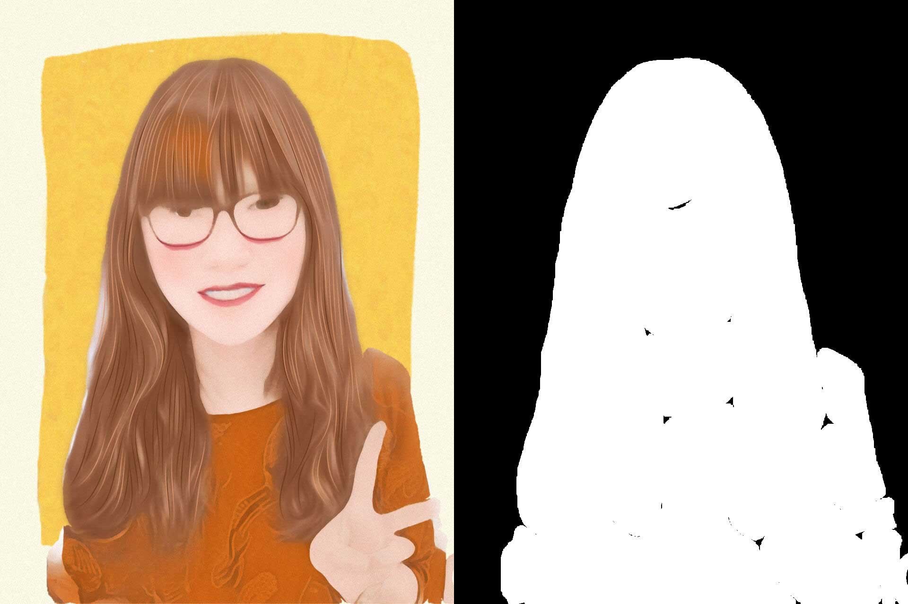

# 详解H5中的图片处理与合成(四)

## 引言：

图片处理现在已经成为了我们生活中的刚需，想必大家也经常有这方面的需求。实际前端业务中，也经常会有很多的项目需要用到图片加工和处理。但是前端的图片处理能力在`js`和设备性能的限制下，其实表现并不突出。由于公司的业务需求，过去一段时间我对这方面积累了一些干货和经验，趁着年后这段时间总结成一系列文章与大家分享，希望能对各位努力中的前端童鞋带来启发和帮助~~~😃

本系列现在构思成以下4个部分:

- 算法类型图片处理技术；
- 基础类型图片处理技术之缩放与裁剪；
- 基础类型图片处理技术之图片合成；
- 基础类型图片处理技术之文案合成；

文章中，我会提到很多在实际运用中所遇到的坑或者经验，应该算是干货满满~~如果能通读，应该能大大提升对前端图片处理领域的理解，有感兴趣的童鞋可以与我深入讨论，希望本文能达到抛砖引玉的效果，让前端在图像处理方面有更多的可能性，有不足之处希望谅解。

通过这些积累，我封装了几个项目中常用的功能：

**图片合成:** [Example](http://f2er.meitu.com/gxd/mcanvas/example/index.html) [Git](https://github.com/xd-tayde/mcanvas)

**图片裁剪:** [Example](http://f2er.meitu.com/hmz/imageclip/example/index.html) [Git](https://github.com/ishareme/clipimage)

**人像抠除:** [Example](http://f2er.meitu.com/gxd/matting/example/index.html) [Git](https://github.com/xd-tayde/matting)

唠叨完这些老套路后，在讲完基础类型的图片处理后，我们开始来介绍算法类型的图片处理技术！~~✈️✈️✈️

这类型的重点主要在于算法和性能层面，在前端由于`js`及设备性能的限制，通常表现并不理想。在真正的线上业务中，为了追求更好的用户体验，只能运行一些相对比较轻量级的，性能好的算法。由服务端来进行进行，会是更好的选择。

> Tips: 由于我对算法方面并没有很深的理解，因此本文主要是一些算法外层及基础原理的讲解，不涉及算法本身。主要希望能帮助大家提升对图片处理的理解。

我们以下面两个🌰来做初步的了解：

## (一) 万圣节小应用

[图片模糊效果(手机体验)](http://api.meitu.com/front_end/xiuxiu/online_mapp/makeup/index.html?makeupType=251&pic=http://mtapplet.meitudata.com/57ea433108c45eb2b166.jpg)

### 效果图如下：

<div align='center'>
	<br/>
</div>

这个小应用是我司的一个万圣节活动。人物脸部的木偶妆容确实很炫酷，但是这里需要复杂的人脸识别，模型比对以及妆容算法，放在前端性能堪忧，因此让服务端来处理，显然是更好的选择。而边框和背景图的模糊处理，这类型的处理就比较适合放在前端了，首先性能能接受，而且更具灵活性，能在不同入口随时替换不同的边框素材。

对于服务端的妆容算法，由于我对算法并没有深入研究，在这里就不展开深入探讨了，我们就直接来梳理下前端的部分:

- 发送原图给服务端，接受妆容处理后的效果图;
- 下载效果图后，缩放成合适大小后进行模糊化的处理，得到模糊后的结果图;
- 将结果图 / 模糊图 / 边框进行像素级的融合; 

> Tips: 这里使用的全是像素级别的算法融合，通过基础类型的合成，同样可以实现。

### 算法性能提升

图片算法处理实质原理其实是 **遍历像素点，对像素点的RGBA值进行改造**。对于改造算法本身，本文就不深入了，不过可以与大家分享下相关的经验。

众所周知，一个好的算法，一个最重要的指标便是性能，而如何提升性能呢？一种是从算法层面来优化，提高循环内部的性能或者更换遍历的方式，算法中的性能会由于遍历的存在被放大无数倍。另一种则是缩小图片大小。

像素点的遍历是一个算法的重要性能消耗点，循环次数直接决定着算法的性能。而像素点的数量与图片的大小尺寸成正向指数级增长，因此适当的缩放图片源后再去处理，对性能的提升十分巨大。例如一张`2000*2000`的图片,像素点足足有400万个，意味着需要遍历400万次，而把图片缩小成 `800*800` 时，循环次数为64万，这里我做过一个测试：

```js
let st = new Date().getTime();
let imgData = [];
for (let i = 0; i < n * 10000; i += 4) {
    let r = getRandom(0,255),
        g = getRandom(0,255),
        b = getRandom(0,255),
        a = 1;
    if (r <= 30 && g <= 30 && b<= 30) {
        a = 0;
    }
    imgData[i] = r;
    imgData[i + 1] = g;
    imgData[i + 2] = b;
    imgData[i + 3] = a;
}
let et = new Date().getTime();
let t = et - st;
console.log(`${n}万次耗时:${et - st}ms`, imgData);
```

测试结果为(mac-chrome-20次取平均):

| 图片尺寸 |  像素数量  | 耗时(ms) | 缩放倍数 |  提升  |
|:-------:|:--------:|:--------:|:------:|:-----:|
|`2000*2000`| 400万  |  168   | 1 |  0% |
|`1600*1600`|   256万 |  98  |  0.8  | 42% |
|`1200*1200`|   144万   |  64   |0.6 | 62% |
|`800*800`|   64万   |  32    |0.4 | 81% |
|`400*400`|   16万   |  10   |0.2| 94% |

可以看出图片的缩小，对性能有非常显著的提升，这里有个特点，性能的提升会随着缩放系数而越来越低，当缩放系数为0.8时，性能已经大大提升了42%，而继续缩放为0.6时，收益便开始大幅降低，只提升了20%。同时缩放图片意味着质量的下降，所以这里需要寻找一个平衡点，再不影响结果图效果的前提下，由尽可能地提升性能，这需要根据算法对图片质量的要求来定。

另外，对原图的裁剪也是个很好的办法，裁剪掉多余的背景部分，也能达到减少遍历次数，提升性能的效果。

### 模糊算法

小应用中模糊部分使用的是 `StackBlur.js` 的模糊算法;代码如下:

```js
// 缩放妆容图;
let srcImg = scaleMid(imgData);

// 创建模糊结果图的容器；
let blurCvs = document.createElement('canvas');
let blurCtx = blurCvs.getContext('2d');

// 先复制一份原图数据,；
let blurImg = blurCtx.createImageData(srcImg.width, srcImg.height);
let size = srcImg.width * srcImg.height * 4;
for (let i = 0; i < size; i++) {
    blurImg.data[i] = srcImg.data[i];
}

// 缩放成400*400的大小进行模糊处理；
blurImg = scale(blurImg, 400);
StackBlur.imageDataRGBA(blurImg, 0, 0, blurImg.width, blurImg.height, 1);

// 处理完后再放大为800*800;
blurImg = scale(blurImg, 800);
```
### 图像融合

我们已经准备好合成最终效果图的所有素材了，模糊背景 / 妆容图 / 边框素材，最后一步便是将3者进行融合，融合的原理是根据最终效果图分区域，在不同区域分别填入对应的素材数据:

```js
// 图片融合
function mix(src, blur, mtl) {
	  // 最终结果图为固定800*800；纵向800的数据；
    for (let i = 0; i < 800; i++) {
        let offset1 = 800 * i;
        
        // 横向800的数据；
        for (let j = 0; j < 800; j++) {
            let offset = (offset1 + j) * 4;
            
            // 在特定的位置填入素材；
            if (i <= 75 || i >= 609 || j <= 126 || j >= 676) {
                let alpha = mtl.data[offset + 3] / 255.0;
                mtl.data[offset] = alpha * mtl.data[offset] + (1 - alpha) * blur.data[offset];
                mtl.data[offset + 1] = alpha * mtl.data[offset + 1] + (1 - alpha) * blur.data[offset + 1];
                mtl.data[offset + 2] = alpha * mtl.data[offset + 2] + (1 - alpha) * blur.data[offset + 2];
                mtl.data[offset + 3] = 255;
            } else {
                let alpha = mtl.data[offset + 3] / 255.0;
                let x = i - 75;
                let y = j - 126;
                let newOffset = (x * 550 + y) * 4;
                mtl.data[offset] = alpha * mtl.data[offset] + (1 - alpha) * src.data[newOffset];
                mtl.data[offset + 1] = alpha * mtl.data[offset + 1] + (1 - alpha) * src.data[newOffset + 1];
                mtl.data[offset + 2] = alpha * mtl.data[offset + 2] + (1 - alpha) * src.data[newOffset + 2];
                mtl.data[offset + 3] = 255;
            }
        }
    }
    return mtl;
}
```

## (二) 抠除人像

这是一个我某天突发奇想的想法，就是基于服务端的人像`mask`层，在前端把人像抠出，不带背景，这样便可以进一步做背景的融合和切换，现在已经用在多个线上项目中了。

**人像抠除:** [Example](http://f2er.meitu.com/gxd/matting/example/index.html) [Git](https://github.com/xd-tayde/matting)

这里需要由服务端处理后的两张效果图:

带背景的结果图和mask图:

<div align ='center'>
	<br/>
</div>


1、我们需要先将`mask`图进行处理:

```js
// 绘制mask；
// mask_zoom: 既为了优化性能所做的缩放系数;
mask = document.createElement('canvas');
maskCtx = mask.getContext('2d');
mask.width = imgEl.naturalWidth * ops.mask_zoom;
mask.height = imgEl.naturalHeight * ops.mask_zoom / 2;
maskCtx.drawImage(imgEl, 0, - imgEl.naturalHeight * ops.mask_zoom / 2, imgEl.naturalWidth * ops.mask_zoom , imgEl.naturalHeight * ops.mask_zoom);
```

2、去除`mask`的黑色背景，变成透明色,这里需要用到像素操作:

```js
// 获取图片数据；
let maskData = maskCtx.getImageData(0, 0, mask.width, mask.height);

// 遍历改造像素点，将接近黑色的点的透明度改成0;
for (let i = 0; i < data.length; i += 4) {
	let r = data[i],
	    g = data[i + 1],
	    b = data[i + 2];
		
	if (r <= 30 && g <= 30 && b<= 30)data[i + 3] = 0;
}

// 将改造后的数据重新填回mask层中;
maskCtx.putImageData(maskData, 0, 0);
```

3、图像融合，这里用到了一个神奇的`canvas`方法，相信大家听过，但并不熟悉 --- `globalCompositeOperation`,该值可以修改`canvas`的融合模式，有多种融合模式大家可以自行研究，这里使用的是`source-in`;

```js
// 创建最终效果图容器；
result = document.createElement('canvas');
resultCtx = result.getContext('2d');
result.width = imgEl.naturalWidth;
result.height = imgEl.naturalHeight;

// 先绘制mask图层做为背景;
resultCtx.drawImage(mask, 0, 0, imgEl.naturalWidth, imgEl.naturalHeight);

// 修改融合模式
resultCtx.globalCompositeOperation = 'source-in';

// 绘制带背景的结果图
resultCtx.drawImage(origin, 0, 0);
```

最终得到的效果图:

<div align ='center'>
	<br/>
</div>

最后就可以使用这种人像图与任何背景或者素材根据业务需求再做融合了。

关于算法级别的图像处理就先了解到这，接下来一篇文章是介绍另一类型的基础类型图片处理，绝对干货满满哟。~~😬😬😬😬，尽情期待！


