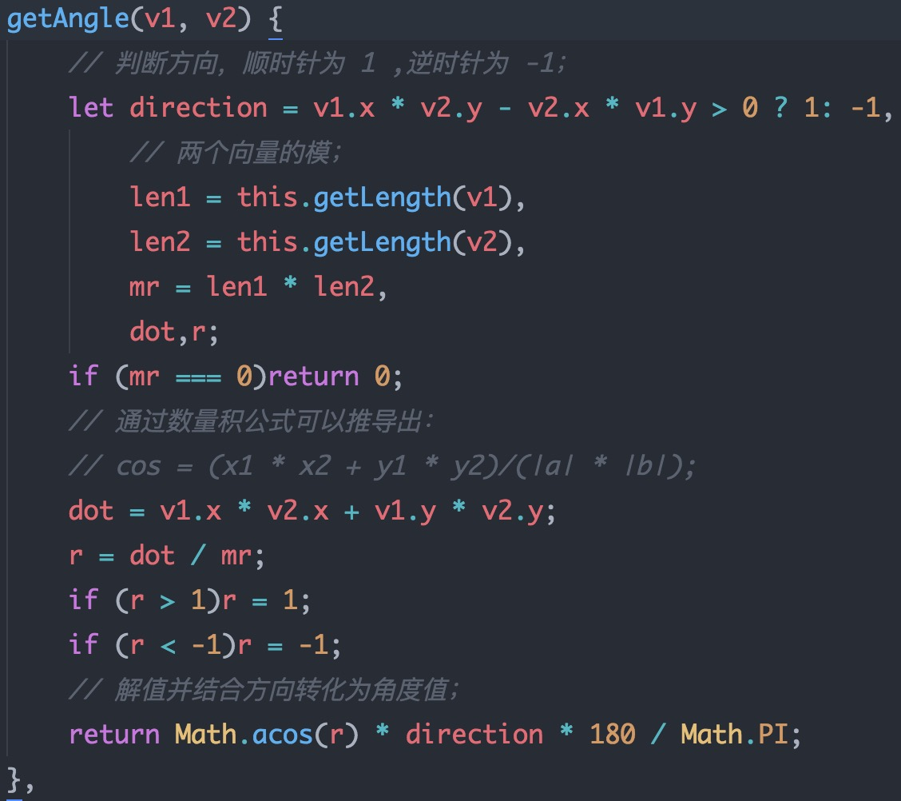
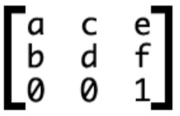
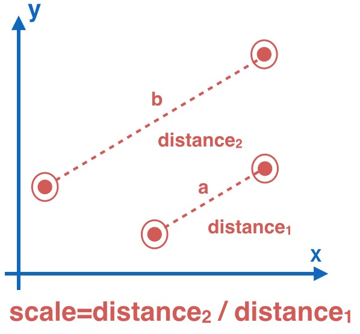
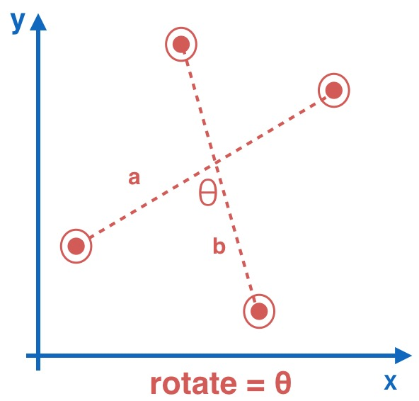
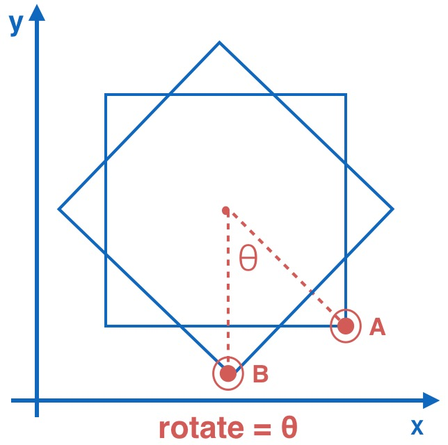

# HTML5中手势原理分析与数学知识的实践

## 引言

在这触控屏的时代，人性化的手势操作已经深入了我们生活的每个部分。现代应用越来越重视与用户的交互及体验，手势是最直接且最为有效的交互方式，一个好的手势交互，能降低用户的使用成本和流程，大大提高了用户的体验。

近期，公司的多个项目中都对手势有着较高的需求，已有的手势库无法完全cover，因此便撸了一个轻量、便于使用的移动端手势库。这篇博文主要是解析了移动端常用手势的原理，及从前端的角度学习过程中所使用的数学知识。希望能对大家有一点点的启发作用，也期待大神们指出不足甚至错误，感恩。

主要讲解项目中经常使用到的五种手势：

- 拖动: `drag`
- 双指缩放: `pinch`
- 双指旋转: `rotate`
- 单指缩放: `singlePinch`
- 单指旋转: `singleRotate`

> Tips :
> 因为 `tap` 及 `swipe` 很多基础库中包含，为了轻便，因此并没有包含,但如果需要，可进行扩展;


## 实现原理

众所周知，所有的手势都是基于浏览器原生事件`touchstart`, `touchmove`, `touchend`, `touchcancel`进行的上层封装，因此封装的思路是通过一个个相互独立的事件回调仓库`handleBus`，然后在原生`touch`事件中符合条件的时机触发并传出计算后的参数值，完成手势的操作。实现原理较为简单清晰，先不急，我们先来理清一些使用到的数学概念并结合代码，将数学运用到实际问题中，数学部分可能会比较枯燥，但希望大家坚持读完，相信会收益良多。

## 基础数学知识函数

我们常见的坐标系属于线性空间，或称向量空间(Vector Space)。这个空间是一个由点(Point) 和 向量(Vector) 所组成集合；

### 点(Point)
可以理解为我们的坐标点,例如原点`O(0,0),A(-1,2)`，通过原生事件对象的`touches`可以获取触摸点的坐标，参数`index`代表第几接触点；

<div align='center'>
	<br/>
</div>

### 向量(Vector)
是坐标系中一种 **既有大小也有方向的线段**，例如由原点`O(0,0)`指向点`A(1,1)`的箭头线段，称为向量`a`，则`a=(1-0,1-0)=(1,1)`;

如下图所示，其中`i`与`j`向量称为该坐标系的单位向量，也称为基向量，我们常见的坐标系单位为`1`,即`i=(1,0)；j=(0,1)`；

<div align='center'>
	<br/>
</div>

获取向量的函数：
<div align='center'>
	<br/>
</div>

### 向量模

代表 **向量的长度**，记为`|a|`，是一个标量，只有大小，没有方向;

几何意义代表的是以`x,y`为直角边的直角三角形的斜边，通过勾股定理进行计算；

<div align='center'>
	<br/> 
</div>

`getLength`函数：

<div align='center'>
	<br/> 
</div>

### 向量的数量积

向量同样也具有可以运算的属性，它可以进行加、减、乘、数量积和向量积等运算，接下来就介绍下我们使用到的数量积这个概念，也称为点积，被定义为公式：

> 当a=(x1,y1),b=(x2,y2)，则a·b=|a|·|b|·cosθ=x1·x2+y1·y2；

### 共线定理

共线，即两个向量处于 **平行** 的状态，当`a=(x1,y1),b=(x2,y2)`，则存在唯一的一个实数λ，使得`a=λb`，代入坐标点后，可以得到 `x1·y2= y1·x2`;

因此当`x1·y2-x2·y1>0` 时，既斜率 **ka > kb** ，所以此时`b`向量相对于`a`向量是属于顺时针旋转，反之，则为逆时针；

### 旋转角度

通过数量积公式我们可以推到求出两个向量的夹角：

> cosθ=(x1·x2+y1·y2)/(|a|·|b|);

然后通过共线定理我们可以判断出旋转的方向，函数定义为：

<div align='center'>
	<br/>
</div>

### 矩阵与变换

由于空间最本质的特征就是其可以容纳运动，因此在线性空间中，

> 我们用向量来刻画对象，而矩阵便是用来描述对象的运动；

#### 而矩阵是如何描述运动的呢?

我们知道，通过一个坐标系基向量便可以确定一个向量，例如 `a=(-1,2)`,我们通常约定的基向量是 i =  与 j = ； 因此:

> a = -1i + 2j = -1  + 2   =  = ;

而矩阵变换的，其实便是通过矩阵转换了基向量，从而完成了向量的变换；

例如上面的栗子，把`a`向量通过矩阵 进行变换，此时基向量`i`由 `(1,0)`变换成`(1,-2)`与`j`由`(0,1)`变换成`(3,0)`,沿用上面的推导，则

> a = -1i + 2j = -1 + 2 =  = 

如下图所示：
A图表示变换之前的坐标系，此时`a=(-1,2)`，通过矩阵变换后，基向量`i，j`的变换引起了坐标系的变换，变成了下图B，因此`a`向量由`(-1,2)`变换成了`(5,-2)`；

> 其实向量与坐标系的关联不变(`a = -1i+2j`)，是基向量引起坐标系变化，然后坐标系沿用关联导致了向量的变化；

<div align='center'>
	<br/>
该图片引用自hcysunyang的文章<br>(https://juejin.im/post/5916851444d904006c5538f8)！
</div>

#### 结合代码

其实CSS的`transform`等变换便是通过矩阵进行的，我们平时所写的`translate/rotate`等语法类似于一种封装好的语法糖，便于快捷使用，而在底层都会被转换成矩阵的形式。例如`transform:translate(-30px,-30px)`编译后会被转换成`transform : matrix(1,0,0,1,30,30)`;

通常在二维坐标系中，只需要 2X2 的矩阵便足以描述所有的变换了， 但由于CSS是处于3D环境中的，因此CSS中使用的是 3X3 的矩阵，表示为：

<div align='center'>
	<br/>
</div>

其中第三行的`0,0,1`代表的就是`z`轴的默认参数。这个矩阵中，`(a,b)` 即为坐标轴的 `i`基，而`(c,d)`既为`j`基,`e`为`x`轴的偏移量,`f`为`y`轴的偏移量;因此上栗便很好理解，**`translate`并没有导致`i，j`基改变，只是发生了偏移**，因此`translate(-30px,-30px) ==> matrix(1,0,0,1,30,30)`~

所有的`transform`语句，都会发生对应的转换，如下：

	// 发生偏移，但基向量不变；
	transform:translate(x,y) ==> transform:matrix(1,0,0,1,x,y)

	// 基向量旋转；
	transform:rotate(θdeg)==> transform:matrix(cos(θ·π/180),sin(θ·π/180),-sin(θ·π/180),cos(θ·π/180),0,0)

	// 基向量放大且方向不变；
	transform:scale(s) ==> transform:matrix(s,0,0,s,0,0)

`translate/rotate/scale`等语法十分强大，让我们的代码更为可读且方便书写，但是`matrix`有着更强大的转换特性，通过`matrix`，可以发生任何方式的变换，例如我们常见的**镜像对称**，`transform:matrix(-1,0,0,1,0,0)`;

<div align='center'>
	<br/>
</div>

#### MatrixTo

然而`matrix`虽然强大，但可读性却不好，而且我们的写入是通过`translate/rotate/scale`的属性,然而通过`getComputedStyle`读取到的 `transform`却是`matrix`:

> transform:matrix(1.41421, 1.41421, -1.41421, 1.41421, -50, -50);

请问这个元素发生了怎么样的变化?。。这就一脸懵逼了。-_-|||

因此，我们必须要有个方法，来将`matrix`翻译成我们更为熟悉的`translate/rotate/scale`方式，在理解了其原理后，我们便可以着手开始表演咯~

我们知道，前4个参数会同时受到`rotate`和`scale`的影响，具有两个变量，因此需要通过前两个参数根据上面的转换方式列出两个不等式：

>	cos(θ·π/180)*s=1.41421;
>
>	sin(θ·π/180)*s=1.41421;

将两个不等式相除，即可以轻松求出`θ`和`s`了，perfect！！函数如下：

<div align='center'>
	<br/>
</div>

## 手势原理

接下来我们将上面的函数用到实际环境中，通过图示的方式来模拟手势的操作，简要地讲解手势计算的原理。希望各位大神理解这些基础的原理后，能创造出更多炫酷的手势，像我们在`mac`触控板上使用的一样。

下面图例：
>	圆点: 代表手指的触碰点;
>
>	两个圆点之间的虚线段: 代表双指操作时组成的向量;
>
>	a向量/A点：代表在 touchstart 时获取的初始向量/初始点；
>
>	b向量/B点：代表在 touchmove 时获取的实时向量/实时点；
>
>	坐标轴底部的公式代表需要计算的值；

### Drag(拖动事件)

<div align='center'>
	<br/>
</div>

上图是模拟了拖动手势，由`A`点移动到`B`点，我们要计算的便是这个过程的偏移量；

因此我们在`touchstart`中记录初始点A的坐标：

```js
// 获取初始点A；
let startPoint = getPoint(ev,0);
```
然后在`touchmove`事件中获取当前点并实时的计算出`△x`与`△y`：
```js
// 实时获取初始点B；
let curPoint = getPoint(ev,0);

// 通过A、B两点，实时的计算出位移增量，触发 drag 事件并传出参数；
_eventFire('drag', {
    delta: {
        deltaX: curPoint.x - startPoint.x,
        deltaY: curPoint.y - startPoint.y,
    },
    origin: ev,
});
```

> Tips: `fire`函数即遍历执行`drag`事件对应的回调仓库即可；

### Pinch(双指缩放)

<div align='center'>
	<br/>
</div>

上图是双指缩放的模拟图，双指由`a`向量放大到`b`向量，通过初始状态时的`a`向量的模与`touchmove`中获取的`b`向量的模进行计算，便可得出缩放值：

```js
// touchstart中计算初始双指的向量模；
let vector1 = getVector(secondPoint, startPoint);
let pinchStartLength = getLength(vector1);

// touchmove中计算实时的双指向量模；
let vector2 = getVector(curSecPoint, curPoint);
let pinchLength = getLength(vector2);
this._eventFire('pinch', {
	delta: {
	    scale: pinchLength / pinchStartLength,
	},
	origin: ev,
});
```


### Rotate(双指旋转)

<div align='center'>
	<br/>
</div>

初始时双指向量`a`，旋转到`b`向量，`θ`便是我们需要的值，因此只要通过我们上面构建的`getAngle`函数，便可求出旋转的角度：

```js
// a向量；
let vector1 = getVector(secondPoint, startPoint);

// b向量；
let vector2 = getVector(curSecPoint, curPoint);

// 触发事件;
this._eventFire('rotate', {
    delta: {
        rotate: getAngle(vector1, vector2),
    },
    origin: ev,
});
```

### singlePinch(单指缩放)

<div align='center'>
	<br/>
</div>

与上面的手势不同，单指缩放和单指旋转都需要多个特有概念：

> 操作元素(`operator`)：需要操作的元素。上面三个手势其实并不关心操作元素，因为单纯靠手势自身，便能计算得出正确的参数值，而单指缩放和旋转需要依赖于操作元素的基准点(操作元素的中心点)进行计算；
>
> 按钮：因为单指的手势与拖动(drag)手势是相互冲突的，需要一种特殊的交互方式来进行区分，这里是通过特定的区域来区分，类似于一个按钮，当在按钮上操作时，是单指缩放或者旋转，而在按钮区域外，则是常规的拖动，实践证明，这是一个用户很容易接受且体验较好的操作方式；

图中由`a`向量单指放大到`b`向量，对操作元(正方形)素进行了中心放大，此时缩放值即为`b`向量的模 / `a`向量的模；

```js
// 计算单指操作时的基准点，获取operator的中心点；
let singleBasePoint = getBasePoint(operator);

// touchstart 中计算初始向量模；
let pinchV1 = getVector(startPoint,singleBasePoint);
singlePinchStartLength = getLength(pinchV1);

// touchmove 中计算实时向量模；
pinchV2 = getVector(curPoint, singleBasePoint);
singlePinchLength = getLength(pinchV2);

// 触发事件；
this._eventFire('singlePinch', {
    delta: {
        scale: singlePinchLength / singlePinchStartLength,
    },
    origin: ev,
});
```

### singleRotate(单指旋转)

<div align='center'>
	<br/>
</div>

结合单指缩放和双指旋转，可以很简单的知道 `θ`便是我们需要的旋转角度；

```js
// 获取初始向量与实时向量
let rotateV1 = getVector(startPoint, singleBasePoint);
let rotateV2 = getVector(curPoint, singleBasePoint);

// 通过 getAngle 获取旋转角度并触发事件；
this._eventFire('singleRotate', {
    delta: {
        rotate: getAngle(rotateV1, rotateV2),
    },
    origin: ev,
});
```

### 运动增量

由于`touchmove`事件是个高频率的实时触发事件，一个拖动操作，其实触发了N次的`touchmove`事件，因此计算出来的值只是一种增量，即代表的是一次 `touchmove`事件增加的值，只代表一段很小的值，并不是最终的结果值，因此需要由`mtouch.js`外部维护一个位置数据，类似于:

```js
//	真实位置数据；
let dragTrans = {x = 0,y = 0};

// 累加上 mtouch 所传递出的增量 deltaX 与 deltaY;
dragTrans.x += ev.delta.deltaX;
dragTrans.y += ev.delta.deltaY;

// 通过 transform 直接操作元素；
set($drag,dragTrans);
```

### 初始位置

维护外部的这个位置数据，如果初始值像上述那样直接取0，则遇到使用css设置了`transform`属性的元素便无法正确识别了，会导致操作元素开始时瞬间跳回`(0,0)`的点，因此我们需要初始去获取一个元素真实的位置值，再进行维护与操作。此时，便需要用到上面我们提到的`getComputedStyle`方法与`matrixTo`函数：

```js
// 获取css transform属性，此时得到的是一个矩阵数据；
// transform:matrix(1.41421,1.41421,-1.41421,1.41421,-50,-50);
let style = window.getComputedStyle(el,null);
let cssTrans = style.transform || style.webkitTransform;

// 按规则进行转换，得到：
let initTrans = _.matrixTo(cssTrans);

// {x:-50,y:-50,scale:2,rotate:45};
// 即该元素设置了：transform:translate(-50px,-50px) scale(2) rotate(45deg);

```


## 结语

至此，相信大家对手势的原理已经有基础的了解，基于这些原理，我们可以再封装出更多的手势，例如双击，长按，扫动，甚至更酷炫的三指、四指操作等，让应用拥有更多人性化的特质。

基于以上原理，我封装了几个常见的工具：（求star -.-）

> Tips: 因为只针对移动端，需在移动设备中打开`demo`，或者pc端开启mobile调试模式！

1. mtouch.js : 移动端的手势库，封装了上述的五种手势，精简的api设计，涵盖了常见的手势交互，基于此也可以很方便的进行扩展。
**[demo](http://f2er.meitu.com/gxd/mtouch/example/index.html)
[github](https://github.com/xd-tayde/mtouch)**

2. touchkit.js : 基于`mtouch`所封装的一层更贴近业务的工具包，可用于制作多种手势操作业务，一键开启，一站式服务。
**[demo](http://f2er.meitu.com/gxd/touchkit/example/index.html)** **[github](https://github.com/xd-tayde/touchkit)**

3. mcanvas.js : 基于canvas 开放极简的api实现图片<段落文字> <混排文字> <裁剪> <平移> <旋转> <缩放> <水印添加> 一键导出等。
**[demo](http://f2er.meitu.com/gxd/mcanvas/example/index.html)** **[github](https://github.com/xd-tayde/mcanvas)**


## 致谢

- 张鑫旭： [获取元素CSS值之getComputedStyle方法熟悉](http://www.zhangxinxu.com/wordpress/2012/05/getcomputedstyle-js-getpropertyvalue-currentstyle/)
- 张鑫旭：[理解CSS3 transform中的Matrix(矩阵)](http://www.zhangxinxu.com/wordpress/2012/06/css3-transform-matrix-%E7%9F%A9%E9%98%B5/)
- AlloyTeam团队的`AlloyFinger`
- hcysunyangd： [从矩阵与空间操作的关系理解CSS3的transform](https://juejin.im/post/5916851444d904006c5538f8)
- [线性代数的理解 学完再看觉得自己弱爆了](http://www.360doc.com/content/14/1112/00/202378_424428214.shtml)
