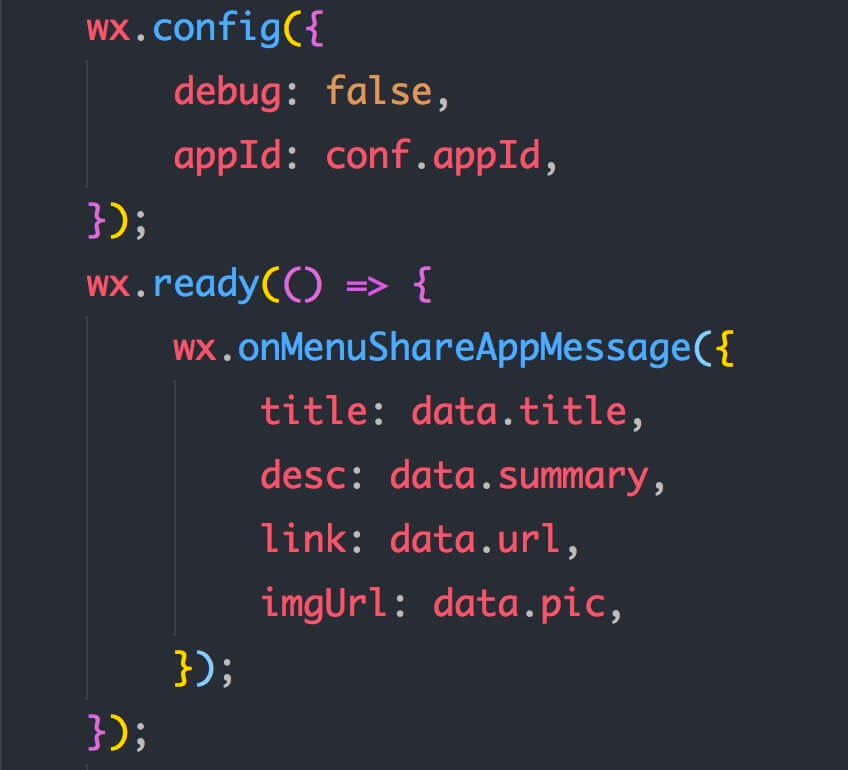
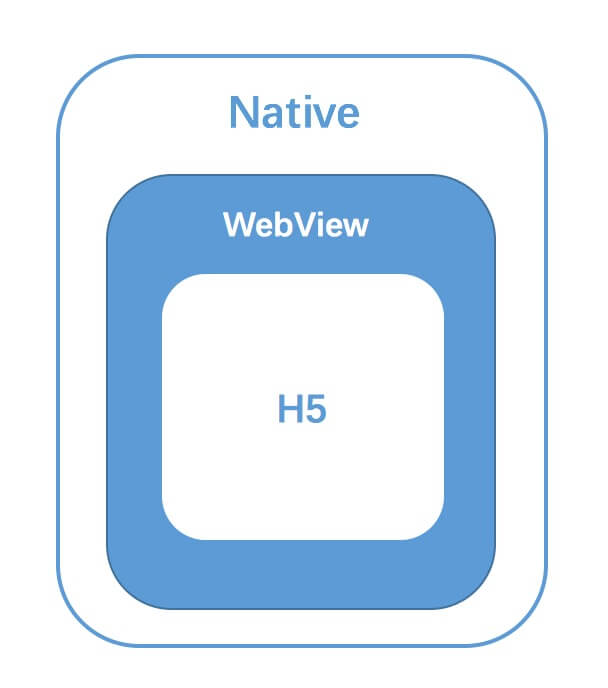
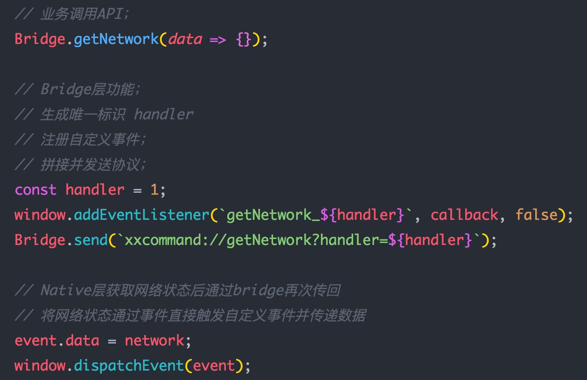
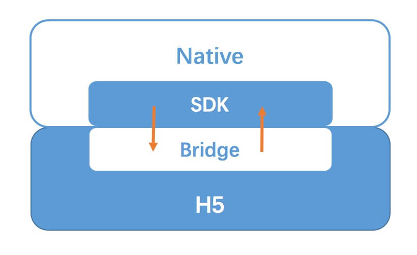

# Hybrid App技术解析 -- 原理篇

## 引言

随着 Web 技术和移动设备的快速发展，Hybrid 技术已经成为一种最主流最常见的方案。一套好的 Hybrid架构方案 能让 App 既能拥有极致的体验和性能，同时也能拥有 Web技术 灵活的开发模式、跨平台能力以及热更新机制，想想是不是都鸡冻不已。。😄。本系列文章是公司在这方面实践的一个总结，包含了原理解析、方案选型与实现、实践优化等方面。

大家可以到[github](https://github.com/xd-tayde/blog/blob/master/hybrid-1.md)上和我进行讨论哈！

## 现有混合方案

Hybrid App，俗称混合应用，即混合了 Native技术 与 Web技术 进行开发的移动应用。现在比较流行的混合方案主要有三种，主要是在UI渲染机制上的不同：

1. 基于 **WebView UI** 的基础方案，市面上大部分主流 App 都有采用，例如微信JS-SDK，通过 JSBridge 完成 H5 与 Native 的双向通讯，从而赋予H5一定程度的原生能力。

2. 基于 **Native UI** 的方案，例如 React-Native、Weex。在赋予 H5 原生API能力的基础上，进一步通过 JSBridge 将js解析成的虚拟节点树(Virtual DOM)传递到 Native 并使用原生渲染。

3. 另外还有近期比较流行的**小程序方案**，也是通过更加定制化的 JSBridge，并使用双 WebView 双线程的模式隔离了JS逻辑与UI渲染，形成了特殊的开发模式，加强了 H5 与 Native 混合程度，提高了页面性能及开发体验。

以上的三种方案，其实同样都是基于 JSBridge 完成的通讯层，第二三种方案，其实可以看做是在方案一的基础上，继续通过不同的新技术进一步提高了应用的混合程度。因此，JSBridge 也是整个混合应用最关键的部分，例如我们在设置微信分享时用到的 JS-SDK，wx对象 便是我们最常见的 JSBridge:

<div align='center'>
	<br/>
</div>

## 方案选型

任何技术方案的选型，其实都应该基于使用场景和现有条件。基于公司现有情况的几点考虑，在方案一上进一步优化，更加适合我们的需求。

- 需求 Web技术 快速迭代、灵活开发的特点和线上热更新的机制。

- 产品的核心能力是强大的拍照与底层图片处理能力，因此单纯的 H5技术能做的事非常有限，不能满足需求，通过 Hybrid 技术来强化H5，便是一种必需。

- 公司业务上，并没有非常复杂的UI渲染需求，而且 App 中的一系列原生 UI组件 已经非常成熟，因此我们并不强需类似 RN 这样的方案。

因此，**如何既能利用 H5 强大的开发和迭代能力，又能赋予 H5 强大的底层能力和用户体验，同时能复用现有的成熟 Native组件**，便成为了我们最大的需求点 -- 一套完整又强大的 Hybrid技术架构方案。😠

## Hybrid技术原理

Hybrid App的本质，其实是在原生的 App 中，使用 WebView 作为容器直接承载 Web页面。因此，最核心的点就是 Native端 与 H5端 之间的**双向通讯层**，其实这里也可以理解为我们需要一套**跨语言通讯方案**，来完成 Native(Java/Objective-c/...) 与 JavaScript 的通讯。这个方案就是我们所说的 JSBridge，而实现的关键便是作为容器的 WebView，一切的原理都是基于 WebView 的机制。

<div align='center'>
	<br/>
</div>

### (一) JavaScript 通知 Native

基于 WebView 的机制和开放的 API, 实现这个功能有三种常见的方案：

- **API注入**，原理其实就是 Native 获取 JavaScript环境上下文，并直接在上面挂载对象或者方法，使 js 可以直接调用，Android 与 IOS 分别拥有对应的挂载方式。

- **WebView 中的 prompt/console/alert 拦截**，通常使用 prompt，因为这个方法在前端中使用频率低，比较不会出现冲突；

- **WebView URL Scheme 跳转拦截**；

第二三种机制的原理是类似的，都是通过对 WebView 信息冒泡传递的拦截，从而达到通讯的，接下来我们主要从 **原理-定制协议-拦截协议-参数传递-回调机制** 5个方面详细阐述下第三种方案 -- URL拦截方案。

#### 1. 实现原理

**在 WebView 中发出的网络请求，客户端都能进行监听和捕获**

#### 2. 协议的定制

我们需要制定一套**URL Scheme**规则，通常我们的请求会带有对应的协议开头，例如常见的 https://xxx.com 或者 file://1.jpg，代表着不同的含义。我们这里可以将协议类型的请求定制为:

> xxcommand://xxxx?param1=1&param2=2

这里有几个需要注意点的是:

(1) xxcommand:// 只是一种规则，可以**根据业务进行制定，使其具有含义**，例如我们定义 xxcommand:// 为公司所有App系通用，为通用工具协议：
> xxcommand://getProxy?h=1
 
而定义 xxapp:// 为每个App单独的业务协议。
> xxapp://openCamera?h=2

**不同的协议头代表着不同的含义，这样便能清楚知道每个协议的适用范围。**

(2) 这里不要使用 location.href 发送，因为其自身机制有个问题是同时并发多次请求会被合并成为一次，导致协议被忽略，而并发协议其实是非常常见的功能。我们会使用**创建 iframe 发送请求**的方式。

(3) 通常考虑到安全性，需要**在客户端中设置域名白名单或者限制**，避免公司内部业务协议被第三方直接调用。

#### 3.协议的拦截

客户端可以通过 API 对 WebView 发出的请求进行拦截：

- IOS上: shouldStartLoadWithRequest

- Android: shouldOverrideUrlLoading

当解析到请求 URL 头为制定的协议时，便不发起对应的资源请求，而是**解析参数，并进行相关功能或者方法的调用**，完成协议功能的映射。

#### 4.协议回调

由于协议的本质其实是发送请求，这属于一个异步的过程，因此我们便需要处理对应的回调机制。这里我们采用的方式是JS的事件系统，这里我们会用到 `window.addEventListener` 和 `window.dispatchEvent`这两个基础API；

- 1.发送协议时，通过协议的唯一标识注册自定义事件，并将回调绑定到对应的事件上。

- 2.客户端完成对应的功能后，调用 Bridge 的dispatch API，直接携带 data 触发该协议的自定义事件。

<div align='center'>
	<br/>
</div>

通过事件的机制，会让开发更符合我们前端的习惯，例如当你需要监听客户端的通知时，同样只需要在通过 `addEventListener` 进行监听即可。

**Tips:** 这里有一点需要注意的是，应该避免事件的多次重复绑定，因此当唯一标识重置时，需要`removeEventListener`对应的事件。

#### 5.参数传递方式

由于 WebView 对 URL 会有长度的限制，因此常规的通过 search参数 进行传递的方式便具有一个问题，既 **当需要传递的参数过长时，可能会导致被截断**，例如传递base64或者传递大量数据时。

因此我们需要制定新的参数传递规则，我们使用的是函数调用的方式。这里的原理主要是基于: 

**Native 可以直接调用 JS 方法并直接获取函数的返回值。**

我们只需要对每条协议标记一个唯一标识，并把参数存入参数池中，到时客户端再通过该唯一标识从参数池中获取对应的参数即可。

### (二) Native 通知 Javascript

由于 Native 可以算作 H5 的宿主，因此拥有更大的权限，上面也提到了 **Native 可以通过 WebView API直接执行 Js 代码**。这样的权限也就让这个方向的通讯变得十分的便捷。

- IOS: stringByEvaluatingJavaScriptFromString

```js
// Swift
webview.stringByEvaluatingJavaScriptFromString("alert('NativeCall')")
```
- Android: loadUrl (4.4-) 

```js
// 调用js中的JSBridge.trigger方法
// 该方法的弊端是无法获取函数返回值；
webView.loadUrl("javascript:JSBridge.trigger('NativeCall')")
```

**Tips:** 当系统低于4.4时，evaluateJavascript 是无法使用的，因此单纯的使用 loadUrl 无法获取 JS 返回值，这时我们需要使用前面提到的 prompt 的方法进行兼容，让 H5端 通过 prompt 进行数据的发送，客户端进行拦截并获取数据。

- Android: evaluateJavascript (4.4+) 

```js
// 4.4+后使用该方法便可调用并获取函数返回值；
mWebView.evaluateJavascript（"javascript:JSBridge.trigger('NativeCall')", 	 new ValueCallback<String>() {
    @Override
    public void onReceiveValue(String value) {
        //此处为 js 返回的结果
    }
});
```

基于上面的原理，我们已经明白 JSBridge 最基础的原理，并且能实现 Native <=> H5 的双向通讯机制了。

<div align='center'>
	<br/>
</div>

### (三) JSBridge 的接入

接下来，我们来理下代码上需要的资源。实现这套方案，从上图可以看出，其实可以分为两个部分:

- **JS部分(bridge)**: 在JS环境中注入 bridge 的实现代码，包含了协议的拼装/发送/参数池/回调池等一些基础功能。

- **Native部分(SDK)**: 在客户端中 bridge 的功能映射代码，实现了URL拦截与解析/环境信息的注入/通用功能映射等功能。

我们这里的做法是，将这两部分一起封装成一个 **Native SDK**，由客户端统一引入。客户端在初始化一个 WebView 打开页面时，如果页面地址在白名单中，会**直接在 HTML 的头部注入对应的 bridge.js**。这样的做法有以下的好处：

- 双方的代码统一维护，避免出现版本分裂的情况。有更新时，只要由客户端更新SDK即可，不会出现版本兼容的问题；

- App的接入十分方便，只需要按文档接入最新版本的SDK，即可直接运行整套Hybrid方案，便于在多个App中快速的落地；

- H5端无需关注，这样有利于将 bridge 开放给第三方页面使用。

这里有一点需要注意的是，**协议的调用，一定是需要确保执行在bridge.js 成功注入后**。由于客户端的注入行为属于一个附加的异步行为，从H5方很难去捕捉准确的完成时机，因此这里需要通过客户端监听页面完成后，基于上面的事件回调机制通知 H5端，页面中即可通过`window.addEventListener('bridgeReady', e => {})`进行初始化。

### (四) App中 H5 的接入方式

将 H5 接入 App 中通常有两种方式： 

(1) **在线H5**，这是最常见的一种方式。我们只需要将H5代码部署到服务器上，只要把对应的 URL地址 给到客户端，用 WebView 打开该URL，即可嵌入。该方式的好处在于:

- 独立性强，有非常独立的开发/调试/更新/上线能力；
- 资源放在服务器上，完全不会影响客户端的包体积；
- 接入成本很低，完全的热更新机制。

但相对的，这种方式也有对应的缺点:

- 完全的网络依赖，在离线的情况下无法打开页面；
- 首屏加载速度依赖于网络，网络较慢时，首屏加载也较慢；

通常，这种方式更适用在一些比较轻量级的页面上，例如一些帮助页、提示页、使用攻略等页面。这些页面的特点是**功能性不强，不太需要复杂的功能协议，且不需要离线使用**。在一些第三方页面接入上，也会使用这种方式，例如我们的页面调用微信JS-SDK。

(2) **内置包H5**，这是一种本地化的嵌入方式，我们需要将代码进行打包后下发到客户端，并由客户端直接解压到本地储存中。通常我们运用在一些比较大和比较重要的模块上。其优点是:

- 由于其本地化，首屏加载速度快，用户体验更为接近原生；
- 可以不依赖网络，离线运行；

但同时，它的劣势也十分明显:

- 开发流程/更新机制复杂化，需要客户端，甚至服务端的共同协作；
- 会相应的增加 App 包体积；

这两种接入方式均有自己的优缺点，应该根据不同场景进行选择。

## 总结

本文主要解析了现在Hybrid App的发展现状和其基础原理，包含了

- JavaScript 通知 Native
- Native 通知 Javascript
- JSBridge 的接入
- H5 的接入

只有在了解了其最本质的实现原理后，才能对这套方案进行实现以及进一步的优化。接下来，我们将基于上面的理论，继续探讨如何把这套方案的真正代码实现以及方案优化方案，欢迎大家一起讨论！更多文章内容请到[github](https://github.com/xd-tayde/blog/blob/master/hybrid-1.md)。感谢！😊


