# Hybrid App技术解析 -- 实战篇

## 引言

上一篇原理篇，我们已经详细地阐述了 Hybrid App 的基础原理，了解了 **Native端 和 H5端 是如何通信**的，还有 **bridge 的设计和接入**。而本篇文章将开始把这些原因进一步实践，用代码真正地去实现一套完整且稳定的 Hybrid 方案。如果对原理还有疑问的小伙伴，请移步[Hybrid App技术解析 -- 原理篇](https://github.com/xd-tayde/blog/blob/master/hybrid-1.md)，只有在理解了理论的基础上，进一步与实践相结合，才能真正地去深入一项技术。

如果大家有什么更好的方案或建议，可以到 [github.com/xd-tayde](https://github.com/xd-tayde/blog/blob/master/hybrid-2.md) 上与我进行讨论哈！

## 摩天大楼

说了那么一大堆理论知识，可能有小伙伴会说：“ 你是不是吹流弊啊。”。😅。那就先来简单介绍下我们已经使用这套方案落地的项目之一。

	 

这是一个完全内置在 App 里的 Hybrid 模块，由 Native 与 H5 深度协作完成，总共有 **4个页面**，其中首页和制作页由 H5 制作，而相机页和保存页是复用Native页面。

项目上线一年累积**使用次数已经超过10亿次**。这套方案经受住了考验，并在过程中仍然在不断的优化和拓展。

使用这套实现方案是基于以下几点考虑：

- 整个模块的**风格多变**，整体UI是与妆容所搭配的，而整个模块一直都在持续不断的迭代之中；
- 项目逻辑流程的可变性大，需要H5强大的热更新能力，及时**应对数据的变化，快速的试错和纠正**；
- 拍摄页与保存页是客户端已经有的模块，可以略微定制后直接**复用**；
- 需要由客户端协助**接入多套SDK**，例如使用算法SDK进行复杂的图像处理。

简单看完项目，我们接下来开始 bridge.js 的构建。由于本系列文章主要面向前端童鞋，因此我们主要展开 H5 的部分，即会注入到每个页面头部的 bridge.js 的实现，客户端中的 SDK 部分就不详细解构了，只会提到一些细节。

## 搭建地基 --- bridge.js 架构

基于上篇文章阐述的结构，我们进一步去完善细节部分，先整理成下面这样的流程结构图，大家先看下图，有个大致的概念：

**`nativeCall ` 与 `postMessage ` 这两个主体 API 桥接了 Native端 和 H5端**

	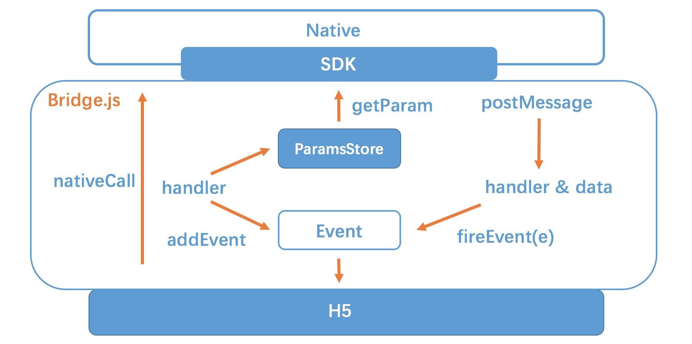 

接下来我们会细看里面各个部分的代码实现。

### (一) 业务方使用姿势

首先，我们先看下在这套方案中，业务方是如何使用的，下面以获取网络状态为例：

	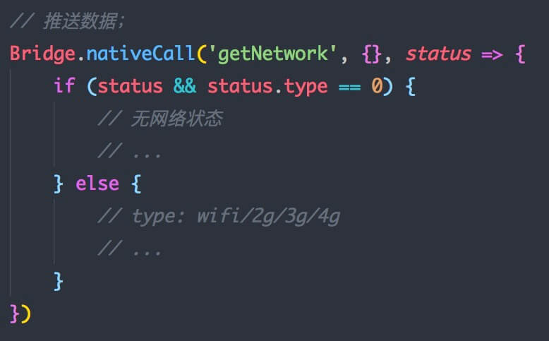 

### (二) H5 --> Native

接下来直接来看 `nativeCall` 的内部实现：

	 

里面可以解构成下面4个步骤:

1. **生成唯一 handler 标识**，从 0 开始累加；
2. 将参数按 handler 值的规则**存入参数池**(_paramsStore)中；
3. 以 handler **注册自定义事件，绑定 callback**，并将 callback也存入 _callbackStore 中，`addEvent()`，储存的目的主要是为了事件解绑时使用；
4. 以 iframe 的形式**发送协议**，并携带唯一标识 handler，`send()`；

	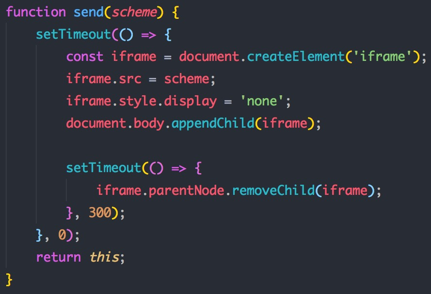 

Native:

- 客户端接收到请求后，会使用 handler 调用 `getParam` 从参数池中**获取对应的参数**。

	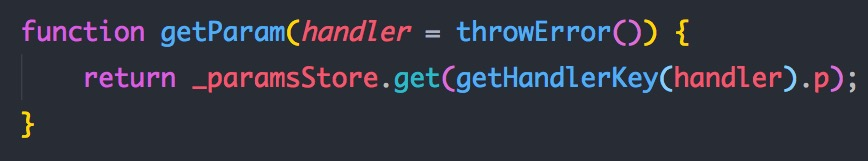 

- **执行**协议对应的**功能**；

这样即走通了 H5 --> Native 的这个流程，在客户端完成了对应的功能后，既开始回传执行结果。

### (二) Native --> H5

Native：

- Native 完成功能后，直接调用 `Bridge.postMessage(handler, data)`，将 **执行结果** 和 之前 `nativeCall` 传过来的 **标识** 回传给 H5；

	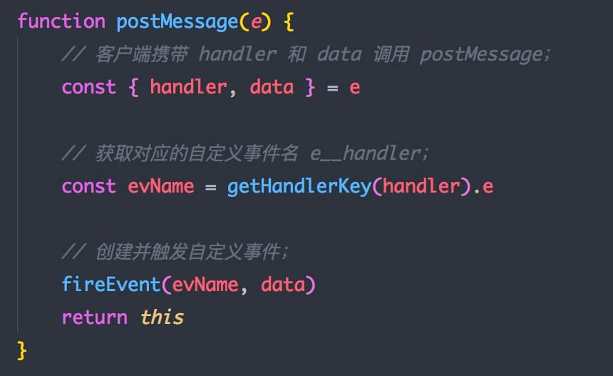 

H5：

- H5 在接收到唯一标识后**初始化对应的自定义事件**，挂载数据后触发，这里涉及的就是 `fireEvent` 这个函数:

	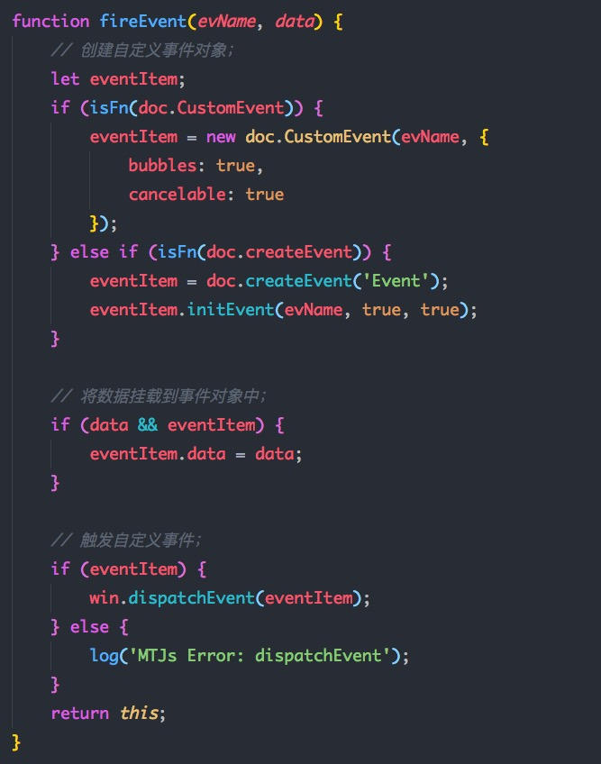 

这样，我们就已经完成了双端之间的双向交互机制了，梳理出了整个 bridge.js 的核心代码了，包含了：

- 最重要的开放API: `nativeCall` 与 `postMessage` ；

- 客户端获取参数函数: `getParam` ；

- 事件回调系统中的 `addEvent` 和 `fireEvent` ；

- 用于发送协议的 `send`。

### 安卓兼容性:

如果看过上一篇[原理篇](https://github.com/xd-tayde/blog/blob/master/hybrid-1.md)的童鞋，这时可能会有个疑问：在 Android 4.4以下时，使用的 `loadUrl` 进行 js 函数的调用，而此时是无法获取函数的返回值的，也就是说4.4- 时，安卓并无法通过 `getParam` 这个函数来获取到协议的参数，这里需要做兼容性的处理，而我们这里可以使用一个曲线救国的骚操作，使用到的原理就是上一篇文章中有提到的另一种 H5 -> Native 的方案：

**WebView 中的 prompt 拦截**

方案如下:

- 当安卓接受到协议，并拿到 handler 值；
- 使用无兼容性问题的 `loadUrl` 执行 js：`Bridge.getParam(handler)` ，直接将返回值直接通过 js 中的 `prompt` 发出：

	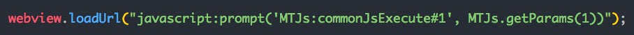 

- 通过重写 `onJsPrompt` 这个方法，拦截上一步发出的 prompt 的内容，并解析出相应的参数；

	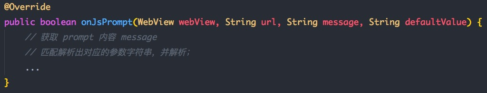 

通过这样的方式，安卓全平台都可以完成参数的获取，并且方式统一，不需要分平台兼容，这就非常的skrskr啦。~~🤘🏻🤘🏻

现在看下来，是不是觉得炒鸡简单？。分分钟能写100个。😂。没错！其实核心的原理就是这么的简单，但这只是一个最基础的地基而已，而基于地基之上，我们就可以开始一层一层建造我们的大楼了！

## 建造大楼 --- 协议的定制

在完成最基础的架构后，我们就可以开始来进一步完成一些上层建筑了，制定一系列真正开放给业务方使用的协议 API，完善整套方案。

首先我们可以将这些协议分成 **功能协议** 和 **业务协议**。

### 功能协议

这类协议是指用于**完善整套方案的基础功能**的一些通用协议，以`command://`作为通用头，封装在 SDK 之中，可以在全线 App、全线 WebView 中使用：

### 1.初始化机制

上篇文章有提到由于 bridge.js 注入的异步性，我们需要由客户端在注入完成后通知 H5。

这里我们可以约定一个**通用的初始化事件**，这里我们约定为 `_init_`，因此前端就可以进行入口的监听, 类似于我们常用的 `DOMContentLoaded`:

	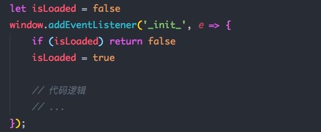 

大家可以看到，这里用了个标记位用于**避免事件被重复触发**，这是由于客户端中是通过监听 WebView 的生命周期钩子来触发的，而 iframe 之类的操作会导致这些钩子的多次触发，因此需要双方各做一层防御性措施。

接下来，我们可以通过该事件，直接初始化传给H5一些**环境参数和系统信息**等，下面是我们使用到的：

	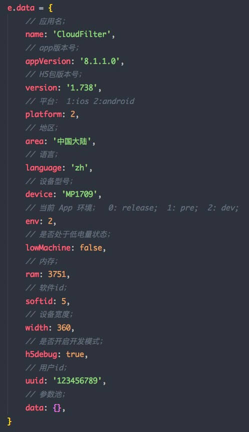 

同样的，我们可以**约定更多的页面生命周期事件**，例如因为App很经常性的隐藏到后台，因此在被激活时，我们可以设置个生命周期: `_resume_`，可以用于告知 H5 页面被激活。

**Tips:**
这里就能体现出我们通过**事件机制**来作为回调系统的优势了，我们可以以最习惯的方式进行事件的监听，而客户端可以直接使用 `bridge.fireEvent('_init_', data)`触发事件，这样便可以优雅地实现 **Native -> H5 的单方向交互**。

### 2.包更新机制

Hybrid模块 的其中一种方式是将前端代码打包后内置于 App 本地，以便拥有最快的启动性能和离线访问能力。而这种方式最大的麻烦点，就是代码的更新，我们不可能每次有修改时就手动重新打包给客户端童鞋替换，而且这样也失去了我们的热更新机制。

因此这里就需要一套**新的热更新机制**，这套机制需要由**客户端/前端/服务端** 三端的童鞋提供对应的资源，共同协作完成整套流程。

**资源：**

- H5: 每个代码包都有一个**唯一且递增的版本号**；
- Native: 提供**包下载且解压到对应目录**的服务，前端可以由下面这个协议来调用该功能。

	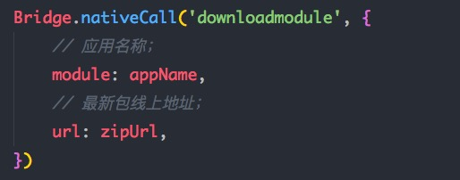 

- 服务端: 提供一个接口，可以**获取线上最新代码包的版本号和下载地址**。

**流程：**

- 前端更新代码打包后按版本号**上传至指定的服务器上**；
- 每次打开页面时，H5请求接口**获取线上最新代码包版本号**，并与本地包进行**版本号比对**，当线上的版本号 大于 本地包版本号时，**发起包下载协议**：
- 客户端接收到协议后，直接去线上地址**下载最新的代码包，并解压替换到当前目录文件**。

拥有这样的机制后，H5在开发后，就可以直接打包将包上传到对应的服务器上，这样在 App 中打开页面后，即可以实时的热更新。

### 3.环境系统 和 多语言系统

通常，我们会将项目分成多个不同的环境，相互隔离。而由于 Hybrid 模块是置于 App 中的，因此环境需要与 App 进行匹配，这里就可以直接使用上面第一点提到的，通过 `_init_` 中携带的数据`data.env`来匹配：

> env:  0 - 正式环境； 1 - 测试环境； 2 - 开发环境；

同理， 多语言也可以直接使用 `e.data.language` 直接进行匹配；

**Tips：**

环境机制我们通常主要用于匹配后端的环境，正式环境和测试环境对应不同的接口。而这里还有一点特别的，就是需要注意代码包的更新，上述的包更新条件要包含三个方面: **版本号、环境和 App版本**，在不同环境不同 App 版本下，也应该更新到相应的最新代码包。

### 4. 事件中转站

由于页面是 H5 开发，而 Native 可能需要控制 H5 页面，例如最常用的场景: 

当页面中有弹窗或者SPA切换页面时，**安卓的返回实体键**应该能完成对应的回退，而不是因为 WebView 没有 history 就直接关闭。

类似于这类需求，这里就可以定制一个**事件中心**(`_eventListeners_ `)，用于监听客户端的实体返回键：

	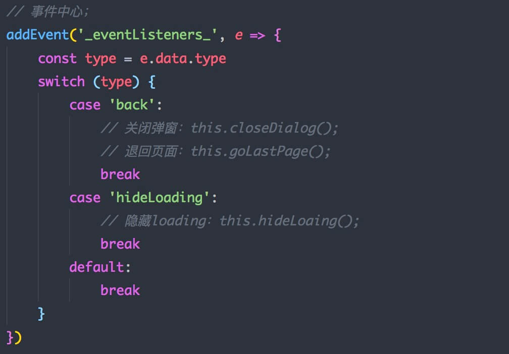 

     

### 5. 数据传递机制

在业务中，很多场景需要做到 Native 与 H5 **保持数据的同步**，此时就可以使用类似上面的原理，制定一套数据传递协议:

	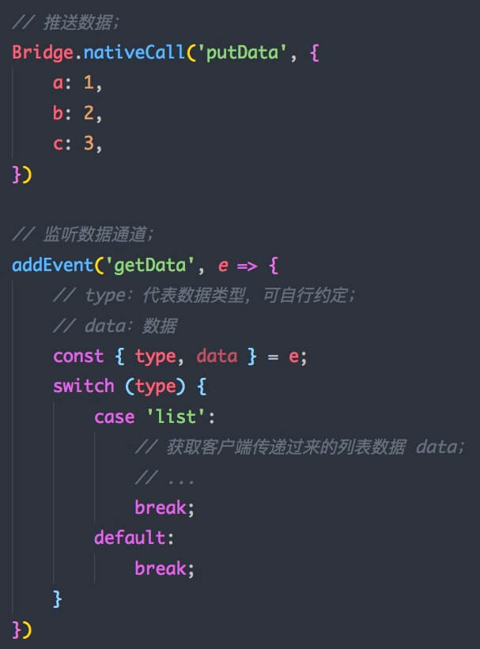 

**Tips：**

Hybrid模块通常需要从对应的入口进入，因此这里有一种可以优化的方式： 

**由 App 在启动时先去获取线上数据，在进入 WebView 后直接通过 `_init_` 或者触发 `getData` 直接发送给 H5**，这样能减少请求数量，优化用户体验。

### 6. 代理请求

H5中最常用的就是请求，通常我们可以直接使用ajax，但是这里有几个问题比较棘手:

- 最常见的**请求跨域**；
- 数据**算法加密**；
- 用户**登录校验**；

而客户端的请求便不会出现这些问题，因此我们可以由客户端代理我们发出的请求，可以定制4个协议: `getProxy`，`postProxy`， `getProxyLogined`，`postProxyLogined`，其中带有 `Logined` 的协议代表着在请求时会自动**携带已登录用户的 token 和 uid 等参数**，使用在一些需要登录信息的接口上。这样做的好处是 

- H5 方就无需处理繁多的各项复杂信息，不需要进行跨端传输；
- 能够对 H5 与 Native 的请求出口进行统一，方便加工处理。

	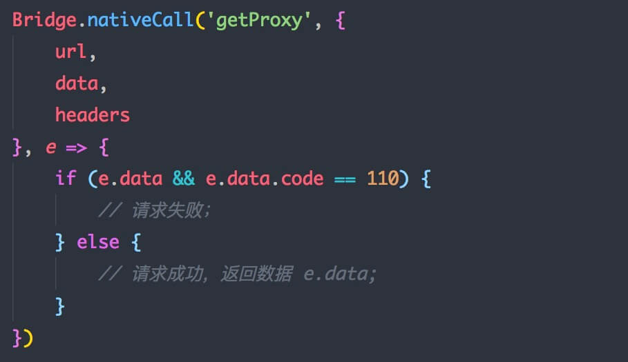 

### 7.更多

除了这些重要的功能外，我们还可以非常自由地定制很多协议，让 H5 拥有更多更强大的功能，下面是我们所定制的一些功能：

- `getNetwork`：获取网络状态；
- `openApp`：唤起其它 App；
- `setShareInfo`与`callShare`：分享内容到第三方平台；
- `link`：使用新的 WebView 打开页面；
- `closeWebview`：关闭 WebView；
- `setStorage` 与 `getStorage`：设置与获取缓存数据；
- `loading`：调用客户端通用 Loading；
- `setWebviewTitle`：设置 WebView 标题；
- `saveImage`：保存图片到本地；
- ...

这里可以定义更多的通用性协议，这里有个原则可以遵守，即这部分协议应该是**基础性功能，应该是纯净的，适用于所有的业务方**。根据上篇文章提到的理念，这部分是当成通用 SDK 进行维护与升级的，因此不应该耦合业务层的任何逻辑。

而有时我们会遇到需要定制一些业务上的逻辑，例如上面提到的项目中，我们要将用户图片通过算法处理成卡通画。这样的需求就是非常的业务化，不适用于其它项目，因此我们应该定制成业务协议。

### 业务协议

这类协议区别于功能协议，它们会杂合一定程度的业务逻辑，而这些逻辑只是针对于特定的项目。其实对于 H5 的使用上，差别并不大，只是使用对应特殊的协议头用于区分，例如:

	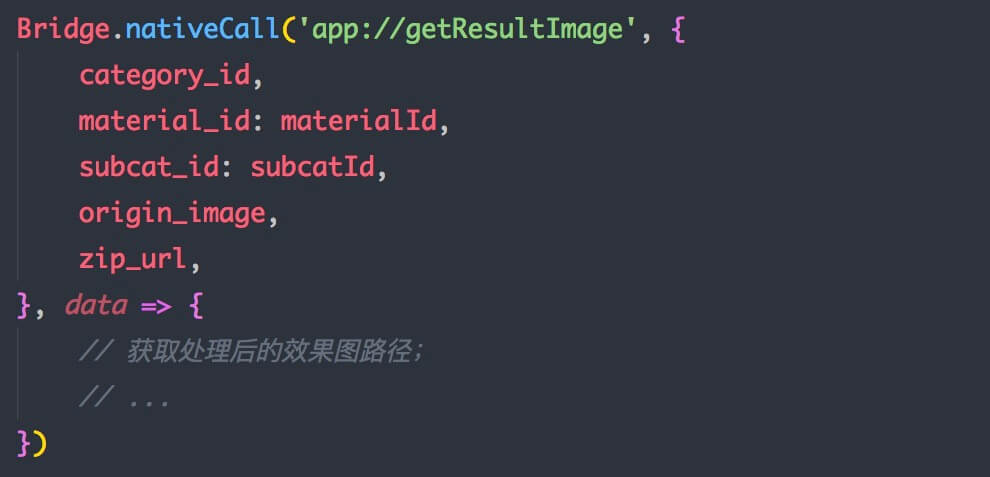 

这类协议通常不包含在 SDK 中，因此需要由客户端的童鞋针对项目的 WebView 进行定制，使用 bridge.js 提供的基础功能实现对应的复杂功能。而在其它的项目入口中，就无法使用这些协议。

## 总结

看到总结两个字，有没有长舒了一口气。。😅。通过这两篇文章，我们终于将 Hybrid 方案的前端部分完全的解构清楚了，是不是有种神清气爽的感觉，完全可以马上开启你们的 Hybrid 之旅了。鼓掌鼓掌！！👏👏👏！！

但这也远非终点，或者说这永无终点。~大楼建成后，离真正的摩天大楼还是差着一步 --- 内部装修，其实接下来我们还需要做很多的优化措施，来解决一些仍然存在的问题，这部分其实我们也一直还在努力的阶段。

受篇幅所限，有时间会将这部分再写一篇优化篇，主要来与大家探讨下我们所能想到的一些优化方案，非常期待大佬们也能给我们提供更多的建议和解决办法。感恩~~😇

更多文章 [摸我](https://github.com/xd-tayde/blog) 阅读。。😻😻😻

