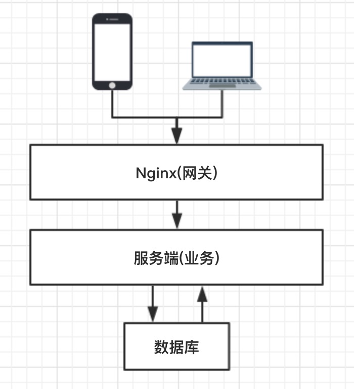
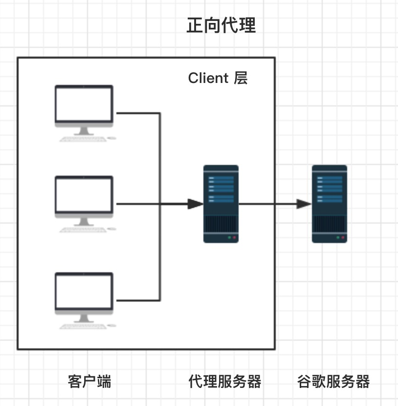
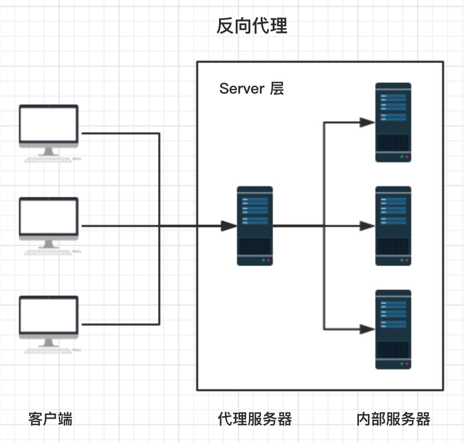

# (下篇)中高级前端大厂面试秘籍，寒冬中为您保驾护航，直通大厂

## 引言

本篇文章会继续沿着前面两篇的脚步，继续梳理前端领域一些比较主流的进阶知识点，力求能让大家在横向层面有个全面的概念。能在面试时有限的时间里，能够快速抓住重点与面试官交流。这些知识点属于加分项，如果能在面试时从容侃侃而谈，想必面试官会记忆深刻，为你折服的~🤤

另外有许多童鞋提到: 面试造火箭，实践全不会，对这种应试策略表达一些担忧。其实我是觉得面试或者这些知识点，也仅仅是个初级的 **开始**。能帮助在初期的快速成长，但这种策略并没办法让你达到更高的水平，只有后续不断地真正实践和深入研究，才能突破自己的瓶颈，继续成长。面试，不也只是一个开始而已嘛。~😋

建议各位小伙从基础入手，先看 

- [(上篇)中高级前端大厂面试秘籍，寒冬中为您保驾护航，直通大厂](https://github.com/xd-tayde/blog/blob/master/interview-1.md)
- [(中篇)中高级前端大厂面试秘籍，寒冬中为您保驾护航，直通大厂](https://github.com/xd-tayde/blog/blob/master/interview-2.md)

## 进阶知识 

## Hybrid

随着 Web技术 和 移动设备 的快速发展，在各家大厂中，Hybrid 技术已经成为一种最主流最不可取代的架构方案之一。一套好的 Hybrid 架构方案能让 App 既能拥有 **极致的体验和性能**，同时也能拥有 Web技术 **灵活的开发模式、跨平台能力以及热更新机制**。因此，相关的 Hybrid 领域人才也是十分的吃香，精通Hybrid 技术和相关的实战经验，也是面试中一项大大的加分项。

### 1. 混合方案简析

Hybrid App，俗称 **混合应用**，即混合了 Native技术 与 Web技术 进行开发的移动应用。现在比较流行的混合方案主要有三种，主要是在UI渲染机制上的不同: 

- **Webview UI**:
	- 通过 JSBridge 完成 H5 与 Native 的双向通讯，并 **基于 Webview** 进行页面的渲染；
	- **优势**: 简单易用，架构门槛/成本较低，适用性与灵活性极强；
	- **劣势**: Webview 性能局限，在复杂页面中，表现远不如原生页面；

- **Native UI**:
	- 通过 JSBridge 赋予 H5 原生能力，并进一步将 JS 生成的虚拟节点树(Virtual DOM)传递至 Native 层，并使用 **原生系统渲染**。
	- **优势**: 用户体验基本接近原生，且能发挥 Web技术 开发灵活与易更新的特性；
	- **劣势**: 上手/改造门槛较高，最好需要掌握一定程度的客户端技术。相比于常规 Web开发，需要更高的开发调试、问题排查成本；
	
- **小程序**
	- 通过更加定制化的 JSBridge，赋予了 Web 更大的权限，并使用双 WebView 双线程的模式隔离了 JS逻辑 与 UI渲染，形成了特殊的开发模式，加强了 H5 与 Native 混合程度，属于第一种方案的优化版本；
	- **优势**: 用户体验好于常规 Webview 方案，且通常依托的平台也能提供更为友好的开发调试体验以及功能；
	- **劣势**: 需要依托于特定的平台的规范限定

### 2. Webviev

Webview 是 Native App 中内置的一款基于 Webkit内核 的浏览器，主要由两部分组成:

- **WebCore 排版引擎**；
- **JSCore 解析引擎**；

在原生开发 SDK 中 Webview 被封装成了一个组件，用于作为 Web页面 的容器。因此，作为宿主的客户端中拥有更高的权限，可以对 Webview 中的 Web页面 进行配置和开发。

Hybrid技术中双端的交互原理，便是基于 Webview 的一些 API 和特性。

### 3. 交互原理

Hybrid技术 中最核心的点就是 Native端 与 H5端 之间的 **双向通讯层**，其实这里也可以理解为我们需要一套 **跨语言通讯方案**，便是我们常听到的 JSBridge。

- JavaScript 通知 Native
	- **API注入**，Native 直接在 JS 上下文中挂载数据或者方法
		- 延迟较低，在安卓4.1以下具有安全性问题，风险较高 
	- WebView **URL Scheme** 跳转拦截
		- 兼容性好，但延迟较高，且有长度限制 
	- WebView 中的 **prompt/console/alert拦截**(通常使用 prompt)
	
- **Native 通知 Javascript**:
	- **IOS**: `stringByEvaluatingJavaScriptFromString`
	
	```js
	// Swift
	webview.stringByEvaluatingJavaScriptFromString("alert('NativeCall')")
	```
	
	- **Android**: `loadUrl` (4.4-)  

	```js
	// 调用js中的JSBridge.trigger方法
	// 该方法的弊端是无法获取函数返回值；
	webView.loadUrl("javascript:JSBridge.trigger('NativeCall')")
	```

	- **Android**: `evaluateJavascript` (4.4+)
	
	```js
	// 4.4+后使用该方法便可调用并获取函数返回值；
	mWebView.evaluateJavascript（"javascript:JSBridge.trigger('NativeCall')", 	 new ValueCallback<String>() {
	    @Override
	    public void onReceiveValue(String value) {
	        //此处为 js 返回的结果
	    }
	});
	```
	
### 4. 接入方案

整套方案需要 Web 与 Native 两部分共同来完成:

- **Native**: 负责实现URL拦截与解析、环境信息的注入、拓展功能的映射、版本更新等功能；
- **JavaScirpt**: 负责实现功能协议的拼装、协议的发送、参数的传递、回调等一系列基础功能。

**接入方式**:

- **在线H5**: 直接将项目部署于线上服务器，并由客户端在 HTML 头部注入对应的 Bridge。
	- **优势**: 接入/开发成本低，对 App 的侵入小；
	- **劣势**: 重度依赖网络，无法离线使用，首屏加载慢；
- **内置离线包**: 将代码直接内置于 App 中，即本地存储中，可由 H5 或者 客户端引用 Bridge。
	- **优势**: 首屏加载快，可离线化使用；
	- **劣势**: 开发、调试成本变高，需要多端合作，且会增加 App 包体积

### 5. 优化方案简述

- **Webview 预加载**: Webview 的初始化其实挺耗时的。我们测试过，大概在100~200ms之间，因此如果能前置做好初始化于内存中，会大大加快渲染速度。
- **更新机制**: 使用离线包的时候，便会涉及到本地离线代码的更新问题，因此需要建立一套云端下发包的机制，由客户端下载云端最新代码包 (zip包)，并解压替换本地代码。
	- **增量更新**: 由于下发包是一个下载的过程，因此包的体积越小，下载速度越快，流量损耗越低。只打包改变的文件，客户端下载后覆盖式替换，能大大减小每次更新包的体积。
	- **条件分发**: 云平台下发更新包时，可以配合客户端设置一系列的条件与规则，从而实现代码的条件更新:
		- 单 **地区** 更新: 例如一个只有中国地区才能更新的版本；
		- 按 **语言** 更新: 例如只有中文版本会更新；
		- 按 App **版本** 更新: 例如只有最新版本的 App 才会更新；
		- **灰度** 更新: 只有小比例用户会更新；
		- **AB测试**: 只有命中的用户会更新；
- **降级机制**: 当用户下载或解压代码包失败时，需要有套降级方案，通常有两种做法: 
	- **本地内置**: 随着 App 打包时内置一份线上最新完整代码包，保证本地代码文件的存在，资源加载均使用本地化路径；
	- **域名拦截**: 资源加载使用线上域名，通过拦截域名映射到本地路径。当本地不存在时，则请求线上文件，当存在时，直接加载；
- **跨平台部署**: Bridge层 可以做一套浏览器适配，在一些无法适配的功能，做好降级处理，从而保证代码在任何环境的可用性，一套代码可同时运行于 App内 与 普通浏览器；
- **环境系统**: 与客户端进行统一配合，搭建出 **正式 / 预上线 / 测试 / 开发**环境，能大大提高项目稳定性与问题排查；
- **开发模式**: 
	- 能连接PC Chrome/safari 进行代码调试；
	- 具有开发调试入口，可以使用同样的 Webview 加载开发时的本地代码；
	- 具备日志系统，可以查看 Log 信息；

详细内容由兴趣的童鞋可以看文章: 

- [Hybrid App技术解析 -- 原理篇](https://github.com/xd-tayde/blog/blob/master/hybrid-1.md)
- [Hybrid App技术解析 -- 实战篇](https://github.com/xd-tayde/blog/blob/master/hybrid-2.md)
	
## Webpack

### 1. 原理简述

Webpack 已经成为了现在前端工程化中最重要的一环，通过`Webpack`与`Node`的配合，前端领域完成了不可思议的进步。通过预编译，将软件编程中先进的思想和理念能够真正运用于生产，让前端开发领域告别原始的蛮荒阶段。深入理解`Webpack`，可以让你在编程思维及技术领域上产生质的成长，极大拓展技术边界。这也是在面试中必不可少的一个内容。

- **核心概念**
	- JavaScript 的 **模块打包工具** (module bundler)。通过分析模块之间的依赖，最终将所有模块打包成一份或者多份代码包 (bundler)，供 HTML 直接引用。实质上，Webpack 仅仅提供了 **打包功能** 和一套 **文件处理机制**，然后通过生态中的各种 Loader 和 Plugin 对代码进行预编译和打包。因此 Webpack 具有高度的可拓展性，能更好的发挥社区生态的力量。
		- **Entry**: 入口文件，Webpack 会从该文件开始进行分析与编译；
		- **Output**: 出口路径，打包后创建 bundler 的文件路径以及文件名；
		- **Module**: 模块，在 Webpack 中任何文件都可以作为一个模块，会根据配置的不同的 Loader 进行加载和打包；
		- **Chunk**: 代码块，可以根据配置，将所有模块代码合并成一个或多个代码块，以便按需加载，提高性能；
		- **Loader**: 模块加载器，进行各种文件类型的加载与转换；
		- **Plugin**: 拓展插件，可以通过 Webpack 相应的事件钩子，介入到打包过程中的任意环节，从而对代码按需修改；
 
- **工作流程** (加载 - 编译 - 输出)
	- 1、读取配置文件，按命令 **初始化** 配置参数，创建 Compiler 对象；
	- 2、调用插件的 apply 方法 **挂载插件** 监听，然后从入口文件开始执行编译；
	- 3、按文件类型，调用相应的 Loader 对模块进行 **编译**，并在合适的时机点触发对应的事件，调用 Plugin 执行，最后再根据模块 **依赖查找** 到所依赖的模块，递归执行第三步；
	- 4、将编译后的所有代码包装成一个个代码块 (Chuck)， 并按依赖和配置确定 **输出内容**。这个步骤，仍然可以通过 Plugin 进行文件的修改;
	- 5、最后，根据 Output 把文件内容一一写入到指定的文件夹中，完成整个过程；

- **模块包装**: 

```js
(function(modules) {
	// 模拟 require 函数，从内存中加载模块；
	function __webpack_require__(moduleId) {
		// 缓存模块
		if (installedModules[moduleId]) {
			return installedModules[moduleId].exports;
		}
		
		var module = installedModules[moduleId] = {
			i: moduleId,
			l: false,
			exports: {}
		};
		
		// 执行代码；
		modules[moduleId].call(module.exports, module, module.exports, __webpack_require__);
		
		// Flag: 标记是否加载完成；
		module.l = true;
		
		return module.exports;
	}
	
	// ...
	
	// 开始执行加载入口文件；
	return __webpack_require__(__webpack_require__.s = "./src/index.js");
 })({
 	"./src/index.js": function (module, __webpack_exports__, __webpack_require__) {
		// 使用 eval 执行编译后的代码；
		// 继续递归引用模块内部依赖；
		// 实际情况并不是使用模板字符串，这里是为了代码的可读性；
		eval(`
			__webpack_require__.r(__webpack_exports__);
			//
			var _test__WEBPACK_IMPORTED_MODULE_0__ = __webpack_require__("test", ./src/test.js");
		`);
	},
	"./src/test.js": function (module, __webpack_exports__, __webpack_require__) {
		// ...
	},
 })
```

- **总结**:
	- **模块机制**: webpack 自己实现了一套模拟模块的机制，将其包裹于业务代码的外部，从而提供了一套模块机制；
	- **文件编译**: webpack 规定了一套编译规则，通过 Loader 和 Plugin，以管道的形式对文件字符串进行处理；

### 2. Loader

由于 Webpack 是基于 Node，因此 Webpack 其实是只能识别 js 模块，比如 css / html / 图片等类型的文件并无法加载，因此就需要一个对 **不同格式文件转换器**。其实 Loader 做的事，也并不难理解: **对 Webpack 传入的字符串进行按需修改**。例如一个最简单的 Loader:

```js
// html-loader/index.js
module.exports = function(htmlSource) {
	// 返回处理后的代码字符串
	// 删除 html 文件中的所有注释
	return htmlSource.replace(/<!--[\w\W]*?-->/g, '')
}
```

当然，实际的 Loader 不会这么简单，通常是需要将代码进行分析，构建 **AST (抽象语法树)**， 遍历进行定向的修改后，再重新生成新的代码字符串。如我们常用的 Babel-loader 会执行以下步骤:

- babylon 将 ES6/ES7 代码解析成 AST
- babel-traverse 对 AST 进行遍历转译，得到新的 AST
- 新 AST 通过 babel-generator 转换成 ES5

**Loader 特性**:

- **链式传递**，按照配置时相反的顺序链式执行；
- 基于 Node 环境，拥有 **较高权限**，比如文件的增删查改；
- 可同步也可异步；

**常用 Loader**:

- file-loader: 加载文件资源，如 字体 / 图片 等，具有移动/复制/命名等功能；
- url-loader: 通常用于加载图片，可以将小图片直接转换为 Date Url，减少请求；
- babel-loader: 加载 js / jsx 文件， 将 ES6 / ES7 代码转换成 ES5，抹平兼容性问题；
- ts-loader: 加载 ts / tsx 文件，编译 TypeScript；
- style-loader: 将 css 代码以`<style>`标签的形式插入到 html 中；
- css-loader: 分析`@import`和`url()`，引用 css 文件与对应的资源；
- postcss-loader: 用于 css 的兼容性处理，具有众多功能，例如 **添加前缀，单位转换** 等；
- less-loader / sass-loader: css预处理器，在 css 中新增了许多语法，提高了开发效率；

**编写原则**:

- **单一原则**: 每个 Loader 只做一件事；
- **链式调用**: Webpack 会按顺序链式调用每个 Loader；
- **统一原则**: 遵循 Webpack 制定的设计规则和结构，输入与输出均为字符串，各个 Loader 完全独立，即插即用；

### 3. Plugin

插件系统是 Webpack 成功的一个关键性因素。在编译的整个生命周期中，Webpack 会触发许多事件钩子，Plugin 可以监听这些事件，根据需求在相应的时间点对打包内容进行定向的修改。

- 一个最简单的 plugin 是这样的:

```js
class Plugin{
  	// 注册插件时，会调用 apply 方法
  	// apply 方法接收 compiler 对象
  	// 通过 compiler 上提供的 Api，可以对事件进行监听，执行相应的操作
  	apply(compiler){
  		// compilation 是监听每次编译循环
  		// 每次文件变化，都会生成新的 compilation 对象并触发该事件
    	compiler.plugin('compilation',function(compilation) {})
  	}
}
```

- **注册插件**:

```js
// webpack.config.js
module.export = {
	plugins:[
		new Plugin(options),
	]
}
```

- **事件流机制**:

Webpack 就像工厂中的一条产品流水线。原材料经过 Loader 与 Plugin 的一道道处理，最后输出结果。

- 通过链式调用，按顺序串起一个个 Loader；
- 通过事件流机制，让 Plugin 可以插入到整个生产过程中的每个步骤中；

Webpack 事件流编程范式的核心是基础类 **Tapable**，是一种 **观察者模式** 的实现事件的订阅与广播：

```js
const { SyncHook } = require("tapable")

const hook = new SyncHook(['arg'])

// 订阅
hook.tap('event', (arg) => {
	// 'event-hook'
	console.log(arg)
})

// 广播
hook.call('event-hook')
```

Webpack 中两个最重要的类 Compiler 与 Compilation 便是继承于 Tapable，也拥有这样的事件流机制。

- **Compiler**: 可以简单的理解为 **Webpack 实例**，它包含了当前 Webpack 中的所有配置信息，如 options， loaders, plugins 等信息，全局唯一，只在启动时完成初始化创建，随着生命周期逐一传递；

- **Compilation**: 可以称为 **编译实例**。当监听到文件发生改变时，Webpack 会创建一个新的 Comilation 对象，开始一次新的编译。它包含了当前的输入资源，输出资源，变化的文件等，同时通过它提供的 api，可以监听每次编译过程中触发的事件钩子；

- **区别**: 
	- Compiler 全局唯一，且从启动生存到结束；
	- Compilaation 对应每次编译，每轮编译循环均会重新创建；

- **常用 Plugin**:
	- UglifyJsPlugin: 压缩、混淆代码；
	- CommonsChunkPlugin: 代码分割；
	- ProvidePlugin: 自动加载模块；
	- html-webpack-plugin: 加载 html 文件，并引入 css / js 文件；
	- extract-text-webpack-plugin / mini-css-extract-plugin: 抽离样式，生成 css 文件；
	- DefinePlugin: 定义全局变量；
	- optimize-css-assets-webpack-plugin: CSS 代码去重；
	- webpack-bundle-analyzer: 代码分析；
	- compression-webpack-plugin: 使用 gzip 压缩 js 和 css；
	- happypack: 使用多进程，加速代码构建；
	- EnvironmentPlugin: 定义环境变量；

### 4. 编译优化

- **代码优化**:
	- **无用代码消除**，是许多编程语言都具有的优化手段，这个过程称为 DCE (dead code elimination)，即 **删除不可能执行的代码**； 
		- 例如我们的 UglifyJs，它就会帮我们在生产环境中删除不可能被执行的代码，例如:
		
		```js
		var fn = function() {
			return 1;
			// 下面代码便属于 不可能执行的代码；
			// 通过 UglifyJs (Webpack4+ 已内置) 便会进行 DCE；
			var a = 1;
			return a;
		}
		```

	- **摇树优化** (Tree-shaking)，这是一种形象比喻。我们把打包后的代码比喻成一棵树，这里其实表示的就是，通过工具 "摇" 我们打包后的 js 代码，将没有使用到的无用代码 "摇" 下来 (删除)。即 消除那些被 **引用了但未被使用** 的模块代码。
		- **原理**: 由于是在编译时优化，因此最基本的前提就是语法的静态分析，**ES6的模块机制** 提供了这种可能性。不需要运行时，便可进行代码字面上的静态分析，确定相应的依赖关系。
		- **问题**: 具有 **副作用** 的函数无法被 tree-shaking。
			- 在引用一些第三方库，需要去观察其引入的代码量是不是符合预期；
			- 尽量写纯函数，减少函数的副作用；
			- 可使用 webpack-deep-scope-plugin，可以进行作用域分析，减少此类情况的发生，但仍需要注意；
 
- **code-spliting**: **代码分割** 技术，将代码分割成多份进行 **懒加载** 或 **异步加载**，避免打包成一份后导致体积过大，影响页面的首屏加载；
	- Webpack 中使用 SplitChunksPlugin 进行拆分；
	- 按 **页面** 拆分: 不同页面打包成不同的文件； 
	- 按 **功能** 拆分: 
		- 将类似于播放器，计算库等大模块进行拆分后再懒加载引入；
		- 提取复用的业务代码，减少冗余代码；
	- 按 **文件修改频率** 拆分: 将第三方库等不常修改的代码单独打包，而且不改变其文件 hash 值，能最大化运用浏览器的缓存；

- **scope hoisting**: **作用域提升**，将分散的模块划分到同一个作用域中，避免了代码的重复引入，有效减少打包后的代码体积和运行时的内存损耗；

- **编译性能优化**:
	- 升级至 **最新** 版本的 webpack，能有效提升编译性能；
	- 使用 **dev-server / 模块热替换 (HMR)** 提升开发体验；
		- 监听文件变动 **忽略 node_modules** 目录能有效提高监听时的编译效率；
	- **缩小编译范围**: 
		- modules: 指定模块路径，减少递归搜索；
		- mainFields: 指定入口文件描述字段，减少搜索；
		- noParse: 避免对非模块化文件的加载；
		- includes/exclude: 指定搜索范围/排除不必要的搜索范围；
		- alias: 缓存目录，避免重复寻址；
	- `babel-loader`:
		- 忽略`node_moudles`，避免编译第三方库中已经被编译过的代码；
		- 使用`cacheDirectory`，可以缓存编译结果，避免多次重复编译；
	- **多进程并发**:
		 - webpack-parallel-uglify-plugin: 可多进程并发压缩 js 文件，提高压缩速度；
		 - HappyPack: 多进程并发文件的 Loader 解析；
	- **第三方库模块缓存**:
		- DLLPlugin 和 DLLReferencePlugin 可以提前进行打包并缓存，避免每次都重新编译；
	- **使用分析**:
		- Webpack Analyse / webpack-bundle-analyzer 对打包后的文件进行分析，寻找可优化的地方；
		- 配置`profile：true`，对各个编译阶段耗时进行监控，寻找耗时最多的地方；
	- `source-map`:
		- 开发: `cheap-module-eval-source-map`；
		- 生产: `hidden-source-map`；

## 项目性能优化

### 1. 编码优化

编码优化，指的就是 在代码编写时的，通过一些 **最佳实践**，提升代码的执行性能。通常这并不会带来非常大的收益，但这属于 **程序猿的自我修养**，而且这也是面试中经常被问到的一个方面，考察自我管理与细节的处理。

- **数据读取**:
	- 通过作用域链 / 原型链 读取变量或方法时，需要更多的耗时，且越长越慢；
	- 对象嵌套越深，读取值也越慢；
	- **最佳实践**: 
		- 尽量在局部作用域中进行 **变量缓存**；
		- 避免嵌套过深的数据结构，**数据扁平化** 有利于数据的读取和维护；

- **循环**: 循环通常是编码性能的关键点；
	- 代码的性能问题会再循环中被指数倍放大；
	- **最佳实践**:
		- 尽可能 **减少循环次数**；
			- 减少遍历的数据量；
			- 完成目的后马上结束循环；
		- 避免在循环中执行大量的运算，避免重复计算，相同的执行结果应该使用缓存；
		- js 中使用 **倒序循环** 会略微提升性能；
		- 尽量避免使用 for-in 循环，因为它会枚举原型对象，耗时大于普通循环；
		
- **条件流程性能**: Map / Object > switch > if-else

```js
// 使用 if-else
if(type === 1) {

} else if (type === 2) {

} else if (type === 3) {

}

// 使用 switch
switch (type) {
	case 1:
		break;4
	case 2:
		break;
	case 3:
		break;
    default:
        break;
}

// 使用 Map
const map = new Map([
	[1, () => {}],
	[2, () => {}],
	[3, () => {}],
])
map.get(type)()

// 使用 Objext
const obj = {
	1: () => {},
	2: () => {},
	3: () => {},
}
obj[type]()
```

- **减少 cookie 体积**: 能有效减少每次请求的体积和响应时间；
	- 去除不必要的 cookie；
	- 压缩 cookie 大小；
	- 设置 domain 与 过期时间；

- **dom 优化**: 
	- **减少访问 dom 的次数**，如需多次，将 dom 缓存于变量中；
	- **减少重绘与回流**:
		- 多次操作合并为一次；
		- 减少对计算属性的访问；
			- 例如 offsetTop， getComputedStyle 等
			- 因为浏览器需要获取最新准确的值，因此必须立即进行重排，这样会破坏了浏览器的队列整合，尽量将值进行缓存使用；
		- 大量操作时，可将 dom 脱离文档流或者隐藏，待操作完成后再重新恢复；
		- 使用`DocumentFragment / cloneNode / replaceChild`进行操作；
	- 使用事件委托，避免大量的事件绑定；

- **css 优化**: 
	- **层级扁平**，避免过于多层级的选择器嵌套； 
	- **特定的选择器** 好过一层一层查找:  .xxx-child-text{} 优于 .xxx .child .text{}
	- **减少使用通配符与属性选择器**；
	- **减少不必要的多余属性**；
	- 使用 **动画属性** 实现动画，动画时脱离文档流，开启硬件加速，优先使用 css 动画；
	- 使用 `<link>` 替代原生 @import；

- **html 优化**:
	- **减少 dom 数量**，避免不必要的节点或嵌套；
	- **避免``空标签**，能减少服务器压力，因为 src 为空时，浏览器仍然会发起请求
		- IE 向页面所在的目录发送请求；
		- Safari、Chrome、Firefox 向页面本身发送请求；
		- Opera 不执行任何操作。
	- 图片提前 **指定宽高** 或者 **脱离文档流**，能有效减少因图片加载导致的页面回流；
	- **语义化标签** 有利于 SEO 与浏览器的解析时间；  
	- 减少使用 table 进行布局，避免使用`<br />`与`<hr />`；

### 2. 页面基础优化

- **引入位置**: css 文件`<head>`中引入， js 文件`<body>`底部引入；
	- 影响首屏的，优先级很高的 js 也可以头部引入，甚至内联； 
- **减少请求** (http 1.0 - 1.1)，合并请求，正确设置 http 缓存；
- **减少文件体积**: 
	- **删除多余代码**:
		- tree-shaking
		- UglifyJs
		- code-spliting 
	- **混淆 / 压缩代码**，开启 gzip 压缩；
	- **多份编译文件按条件引入**:
		- 针对现代浏览器直接给 ES6 文件，只针对低端浏览器引用编译后的 ES5 文件；
		- 可以利用`<script type="module"> / <script type="module">`进行条件引入用
	- **动态 polyfill**，只针对不支持的浏览器引入 polyfill；
- **图片优化**:
	- 根据业务场景，与UI探讨选择 **合适质量，合适尺寸**；
	- 根据需求和平台，选择 **合适格式**，例如非透明时可用 jpg；非苹果端，使用 webp；
	- 小图片合成 **雪碧图**，低于 5K 的图片可以转换成 **base64** 内嵌；
	- 合适场景下，使用 **iconfont** 或者 **svg**；
- **使用缓存**:
	- **浏览器缓存**: 通过设置请求的过期时间，合理运用浏览器缓存；
	- **CDN缓存**: 静态文件合理使用 CDN 缓存技术；
		- HTML 放于自己的服务器上；
		- 打包后的图片 / js / css 等资源上传到 CDN 上，文件带上 hash 值；
		- 由于浏览器对单个域名请求的限制，可以将资源放在多个不同域的 CDN 上，可以绕开该限制；
	- **服务器缓存**: 将不变的数据、页面缓存到 内存 或 远程存储(redis等) 上；
	- **数据缓存**: 通过各种存储将不常变的数据进行缓存，缩短数据的获取时间；

### 3. 首屏渲染优化

- **css / js 分割**，使首屏依赖的文件体积最小，内联首屏关键 css / js；
- 非关键性的文件尽可能的 **异步加载和懒加载**，避免阻塞首页渲染；
- 使用`dns-prefetch / preconnect / prefetch / preload`等浏览器提供的资源提示，加快文件传输；
- 谨慎控制好 **Web字体**，一个大字体包足够让你功亏一篑；
	- 控制字体包的加载时机；
	- 如果使用的字体有限，那尽可能只将使用的文字单独打包，能有效减少体积；  
- 合理利用 Localstorage / server-worker 等存储方式进行 **数据与资源缓存**；
- **分清轻重缓急**:
	- 重要的元素优先渲染；
	- 视窗内的元素优先渲染；
- **服务端渲染(SSR)**:
	- 减少首屏需要的数据量，剔除冗余数据和请求；
	- 控制好缓存，对数据/页面进行合理的缓存；
	- 页面的请求使用流的形式进行传递；
- **优化用户感知**:
	- 利用一些动画 **过渡效果**，能有效减少用户对卡顿的感知；
	- 尽可能利用 **骨架屏(Placeholder) / Loading** 等减少用户对白屏的感知；
	- 动画帧数尽量保证在 **30帧** 以上，低帧数、卡顿的动画宁愿不要；
	- js 执行时间避免超过 **100ms**，超过的话就需要做:
		- 寻找可 缓存 的点； 
		- 任务的 分割异步 或 web worker 执行；

## 全栈基础

其实我觉得并不能讲前端的天花板低，只是说前端是项更多元化的工作，它需要涉及的知识面很广。你能发现，从最开始的简单页面到现在，其实整个领域是在不断地往外拓张。在许多的大厂的面试中，具备一定程度的 **服务端知识、运维知识，甚至数学、图形学、设计** 等等，都可能是你占得先机的法宝。

### Nginx

轻量级、高性能的 Web 服务器，在现今的大型应用、网站基本都离不开 Nginx，已经成为了一项必选的技术；其实可以把它理解成 **入口网关**，这里我举个例子可能更好理解:

> 当你去银行办理业务时，刚走进银行，需要到入门处的机器排队取号，然后按指令到对应的柜台办理业务，或者也有可能告诉你，今天不能排号了，回家吧！
> 
> 这样一个场景中，**取号机器就是 Nginx(入口网关)**。一个个柜台就是我们的业务服务器(办理业务)；银行中的保险箱就是我们的数据库(存取数据)；🤣
> 



- **特点**:
	- 轻量级，配置方便灵活，无侵入性；
	- 占用内存少，启动快，性能好；
	- 高并发，事件驱动，异步；
	- 热部署，修改配置热生效；

- **架构模型**: 
	- 基于 **socket 与 Linux epoll (I/O 事件通知机制)**，实现了 **高并发**；
		- 使用模块化、事件通知、回调函数、计时器、轮询实现非阻塞的异步模式；
		- 磁盘不足的情况，可能会导致阻塞；
	- **Master-worker 进程模式**:
		- Nginx 启动时会在内存中常驻一个 **Master 主进程**，功能:
			- 读取配置文件；
			- 创建、绑定、关闭 socket；
			- 启动、维护、配置 worker 进程；
			- 编译脚本、打开日志；
		- master 进程会开启配置数量的 **worker 进程**，比如根据 CPU 核数等:
			- 利用 socket 监听连接，不会新开进程或线程，节约了创建与销毁进程的成本；
			- 检查网络、存储，把新连接加入到轮询队列中，异步处理；
			- 能有效利用 cpu 多核，并避免了线程切换和锁等待；
	- **热部署模式**:
		- 当我们修改配置热重启后，master 进程会以新的配置新创建 worker 进程，新连接会全部交给新进程处理；
		- 老的 worker 进程会在处理完之前的连接后被 kill 掉，逐步全替换成新配置的 worker 进程；

- **配置**:
	- 官网下载；
	- 配置文件路径： `/usr/local/etc/nginx/nginx.conf`；
	- 启动: 终端输入 `nginx`，访问 `localhost:8080` 就能看到 `Welcome...`；
	- `nginx -s stop`: 停止服务；
	- `nginx -s reload`: 热重启服务；
	- 配置代理: `proxy_pass`
		- 在配置文件中配置即可完成；

		```js
		server {
		    listen 80;
		    location / {
		        proxy_pass http://xxx.xxx.xx.xx:3000;
		    }
		}
		``` 
		
- **常用场景**: 
	- **代理**:
		- 其实 Nginx 可以算一层 **代理服务器**，将客户端的请求处理一层后，再转发到业务服务器，这里可以分成两种类型，其实实质就是 **请求的转发**，使用 Nginx 非常合适、高效；
	- **正向代理**:
		- 即用户通过访问这层正向代理服务器，再由代理服务器去到原始服务器请求内容后，再返回给用户；
		- 例如我们常使用的 VPN 就是一种常见的正向代理模式。通常我们无法直接访问谷歌服务器，但是通过访问一台国外的服务器，再由这台服务器去请求谷歌返回给用户，用户即可访问谷歌；
		- **特点**: 
			- 代理服务器属于 **客户端层**，称之为正向代理；
			- 代理服务器是 **为用户服务**，对于用户是透明的，用户知道自己访问代理服务器；
			- 对内容服务器来说是 **隐藏** 的，内容服务器并无法分清访问是来自用户或者代理；

	

	- **反向代理**:
		- 用户访问头条的反向代理网关，通过网关的一层处理和调度后，再由网关将访问转发到内部的服务器上，返回内容给用户；
		- **特点**:
			- 代理服务器属于 **服务端层**，因此称为反向代理。通常代理服务器与内部内容服务器会隶属于同一内网或者集群；
			- 代理服务器是 **为内容服务器服务** 的，对用户是隐藏的，用户不清楚自己访问的具体是哪台内部服务器；
			- 能有效保证内部服务器的 **稳定与安全**；

	
	
	- **反向代理的好处**:
		- **安全与权限**:
			- 用户访问必须通过反向代理服务器，也就是便可以在做这层做统一的请求校验，过滤拦截不合法、危险的请求，从而就能更好的保证服务器的安全与稳定；
		- **负载均衡**: 能有效分配流量，最大化集群的稳定性，保证用户的访问质量；
	
	- **负载均衡**:
		- 负载均衡是基于反向代理下实现的一种 **流量分配** 功能，目的是为了达到服务器资源的充分利用，以及更快的访问响应；
		- 其实很好理解，还是以上面银行的例子来看: **通过门口的取号器，系统就可以根据每个柜台的业务排队情况进行用户的分，使每个柜台都保持在一个比较高效的运作状态，避免出现分配不均的情况**；
		- 由于用户并不知道内部服务器中的队列情况，而反向代理服务器是清楚的，因此通过 Nginx，便能很简单地实现流量的均衡分配；
		- Nginx 实现: `Upstream`模块， 这样当用户访问 `http://xxx` 时，流量便会被按照一定的规则分配到`upstream`中的3台服务器上；
		
		```js
		http {
		    upstream xxx {
		        server 1.1.1.1:3001;
		        server 2.2.2.2:3001;
		        server 3.3.3.3:3001;
		    }
		    server {
		        listen 8080;
		        location / {
		            proxy_pass http://xxx;
		        }
		    }
		}
		```
		
		- **分配策略**:
			- **服务器权重(`weight`)**:
				- 可以为每台服务器配置访问权重，传入参数`weight`，例如:

				```js
				 upstream xxx {
			        server 1.1.1.1:3001 weight=1;
			        server 2.2.2.2:3001 weight=1;
			        server 3.3.3.3:3001 weight=8;
			    }
				```
			- **时间顺序(默认)**: 按用户的访问的顺序逐一的分配到正常运行的服务器上；
			- **连接数优先(`least_conn`)**: 优先将访问分配到列表中连接数队列最短的服务器上；
			- **响应时间优先(`fair`)**: 优先将访问分配到列表中访问响应时间最短的服务器上；
			- **ip_hash**: 通过 ip_hash 指定，使每个 ip 用户都访问固定的服务器上，有利于用户特异性数据的缓存，例如本地 session 服务等；
			- **url_hash**: 通过 url_hash 指定，使每个 url 都分配到固定的服务器上，有利于缓存；

	- **Nginx 对于前端的作用**:
		- **1. 快速配置静态服务器**，当访问 `localhost:80` 时，就会默认访问到 `/Users/files/index.html`；
	
		```js
		server {
			listen 80;                                                         
			server_name localhost;                                               
				
			location / {
				root   /Users/files;
				index  index.html;
			}
		}
		``` 
		
		- **2. 访问限制**: 可以制定一系列的规则进行访问的控制，例如直接通过 ip 限制:

		```js
		# 屏蔽 192.168.1.1 的访问；
		# 允许 192.168.1.2 ~ 10 的访问；
		location / {
	        deny  192.168.1.1;
	        allow 192.168.1.2/10;
	        deny  all;
	    }
		```
		
		- **3. 解决跨域**: 其实跨域是 **浏览器的安全策略**，这意味着只要不是通过浏览器，就可以绕开跨域的问题。所以只要通过在同域下启动一个 Nginx 服务，转发请求即可；

		```js
		location ^~/api/ {
	   		 # 重写请求并代理到对应域名下
	        rewrite ^/api/(.*)$ /$1 break;
	        proxy_pass https://www.cross-target.com/;
	    }  
		```
		
		- **4. 图片处理**: 通过 ngx_http_image_filter_module 这个模块，可以作为一层图片服务器的代理，在访问的时候 **对图片进行特定的操作，例如裁剪，旋转，压缩等**；

		- **5. 本地代理，绕过白名单限制**: 例如我们在接入一些第三方服务时经常会有一些域名白名单的限制，如果我们在本地通过`localhost`进行开发，便无法完成功能。这里我们可以做一层本地代理，便可以直接通过指定域名访问本地开发环境；

		```js
		server {
        listen 80;
        server_name www.toutiao.com;

        location / {
            proxy_pass http://localhost:3000;
        }
       }
		```

### Docker 

Docker，是一款现在最流行的 **软件容器平台**，提供了软件运行时所依赖的环境。

- **物理机**: 
	- 硬件环境，真实的 **计算机实体**，包含了例如物理内存，硬盘等等硬件；
	
- **虚拟机**: 
	- 在物理机上 **模拟出一套硬件环境和操作系统**，应用软件可以运行于其中，并且毫无感知，是一套**隔离的完整环境**。本质上，它只是物理机上的一份 **运行文件**。
	
- **为什么需要虚拟机？**
	- **环境配置与迁移**: 
		- 在软件开发和运行中，环境依赖一直是一个很头疼的难题，比如你想运行 node 应用，那至少环境得安装 node 吧，而且不同版本，不同系统都会影响运行。**解决的办法**，就是我们的包装包中直接包含运行环境的安装，让同一份环境可以快速复制到任意一台物理机上。
	- **资源利用率与隔离**: 
		- 通过硬件模拟，并包含一套完整的操作系统，应用可以独立运行在虚拟机中，与外界隔离。并且可以在同一台物理机上，开启多个不同的虚拟机启动服务，即一台服务器，提供多套服务，且资源完全相互隔离，互不影响。不仅能更好提高资源利用率率，降低成本，而且也有利于服务的稳定性。

- **传统虚拟机的缺点**: 
	- **资源占用大**: 
		- 由于虚拟机是模拟出一套 **完整系统**，包含众多系统级别的文件和库，运行也需要占用一部分资源，单单启动一个空的虚拟机，可能就要占用 100+MB 的内存了。
	- **启动缓慢**: 
		- 同样是由于完整系统，在启动过程中就需要运行各种系统应用和步骤，也就是跟我们平时启动电脑一样的耗时。
	- **冗余步骤多**: 
		- 系统有许多内置的系统操作，例如用户登录，系统检查等等，有些场景其实我们要的只是一个隔离的环境，其实也就是说，虚拟机对部分需求痛点来说，其实是有点过重的。
	
- **Linux 容器**: 
	- Linux 中的一项虚拟化技术，称为 Linux 容器技术(LXC)。
	- 它在 **进程层面** 模拟出一套隔离的环境配置，但并没有模拟硬件和完整的操作系统。因此它完全规避了传统虚拟机的缺点，在启动速度，资源利用上远远优于虚拟机；
	
- **Docker**: 
	- Docker 就是基于 Linux 容器的一种上层封装，提供了更为简单易用的 API 用于操作 Docker，属于一种 **容器解决方案**。
	- **基本概念**: 在 Docker 中，有三个核心的概念:
		- **镜像 (Image)**: 
			- 从原理上说，镜像属于一种 **root 文件系统**，包含了一些系统文件和环境配置等，可以将其理解成一套 **最小操作系统**。为了让镜像轻量化和可移植，Docker 采用了 **Union FS 的分层存储模式**。将文件系统分成一层一层的结构，逐步从底层往上层构建，每层文件都可以进行继承和定制。这里从前端的角度来理解: **镜像就类似于代码中的 class，可以通过继承与上层封装进行复用**。
			- 从外层系统看来，一个镜像就是一个 Image **二进制文件**，可以任意迁移，删除，添加；
	- **容器 (Container)**:
		- 镜像是一份静态文件系统，无法进行运行时操作，就如`class`，如果我们不进行实例化时，便无法进行操作和使用。因此 **容器可以理解成镜像的实例**，即 `new 镜像()`，这样我们便可以创建、修改、操作容器；一旦创建后，就可以简单理解成一个轻量级的操作系统，可以在内部进行各种操作，例如运行 node 应用，拉取 git 等；
		- 基于镜像的分层结构，容器是 **以镜像为基础底层**，在上面封装了一层 **容器的存储层**；
			- 存储空间的生命周期与容器一致；
			- 该层存储层会随着容器的销毁而销毁；
			- 尽量避免往容器层写入数据；
		- 容器中的数据的持久化管理主要由两种方式:
			- **数据卷 (Volume)**: 一种可以在多个容器间共享的特殊目录，其处于容器外层，并不会随着容器销毁而删除；
			- **挂载主机目录**: 直接将一个主机目录挂载到容器中进行写入；
	- **仓库 (Repository)**:
		- 为了便于镜像的使用，Docker 提供了类似于 git 的仓库机制，在仓库中包含着各种各样版本的镜像。官方服务是 Docker Hub； 
		- 可以快速地从仓库中拉取各种类型的镜像，也可以基于某些镜像进行自定义，甚至发布到仓库供社区使用；

## 结语

不知不觉，一个月又过去了，也终于完成了整个系列。其实下篇涉及的许多知识点都是有比较深的拓展空间，博主自己也水平有限，无法面面俱到，也许甚至会有些争议或者错误的见解，还望小伙伴们共同指出和纠正。希望这个面试系列能帮助到大家，好好地将这些知识点进行消化和理解，闭关修炼虽然辛苦，但现在已经是时候出山征战江湖，收割 Offer 啦~

整个系列其实仍然是属于浅尝辄止的阶段，后续如果大家想要继续提升，可以往自己感兴趣的方向进行深挖，例如:

- **全栈**: 那可能得更多的去了解 Node / Nginx / 反向代理 / 负载均衡 / PM2 / Docker 等服务端或者运维知识；
- **跨平台**: 可以学习 Hybrid / Flutter / React Native / Swift 等；
- **视觉游戏**: WebGL / 动画 / Three.js / Canvas / 游戏引擎 / VR / AR 等；
- **底层框架**: 浏览器引擎 / 框架底层 / 机器学习 / 算法等；

总之，学无止境呐。造火箭无止境呐。😂。感谢各位小伙伴的观看，共同进步，一起成长！

- [(上篇)中高级前端大厂面试秘籍，寒冬中为您保驾护航，直通大厂](https://github.com/xd-tayde/blog/blob/master/interview-1.md)
- [(中篇)中高级前端大厂面试秘籍，寒冬中为您保驾护航，直通大厂](https://github.com/xd-tayde/blog/blob/master/interview-2.md)

> Tips: 
> 
> 博主真的写得很辛苦，再不 star 下，真的要哭了。~ [github](https://github.com/xd-tayde/blog/blob/master/interview-3.md)。🤑
> 
> 联系我请发邮件: 159042708@qq.com 😆


